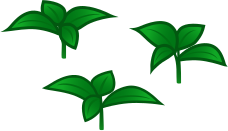
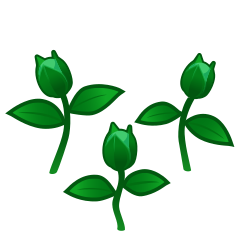
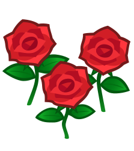
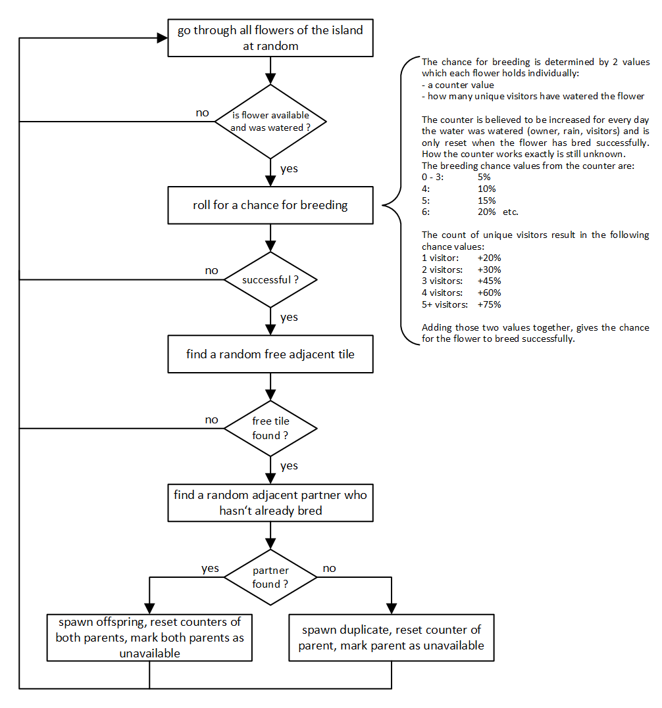

* Contents
{:toc}
# Credits

* Daily Refresh Algorithm & Flower Calendar datamined by [Ninji](https://twitter.com/_Ninji)
* Flower Heredity datamined by [Aeter](https://twitter.com/aiterusawato)
* Flower Attributes datamined by Psi & Aeter
* Reproduction flowchart courtesy of [Aeon](https://twitter.com/AeonSake)
* Flower Stages .svg images courtesy of [Kamirose](https://twitter.com/kamirose)

# Introduction

Flowers are part of the natural vegetation, along with weeds, bushes and trees. 

They mostly serve as a decoration for your island, and increase its star rating. Once fully grown, they can also be plucked to serve as a crafting material.

Flowers exist in various species. Each species has three different basic colors, and more colors can be obtained by breeding.

Flowers also have hidden values called genes, which determine their color and their offspring's potential colors. A flower's color is called the phenotype, and the ensemble of its genes are called the genotype.

When flowers are watered, they will have a chance to reproduce on the next day, which will spawn a new flower next to its parent.

# Flower Data

Every flower's apparence, growing and reproducing behavior is determined by the information stored in its internal data.

Here are all the relevant fields.

|                   Field                    | Format        | Contents                                                     |
| :----------------------------------------: | ------------- | ------------------------------------------------------------ |
|    ![Gold Can][] GF Gold Flag    | 1 bit         | Black rose only Determines the flower's ability to produce a gold rose → Set when watered by a golden watering can → Reset when a gold rose is produced |
| ![Can][]  HF Hydration Flag | 1 bit         | Hydration state, dry or hydrated Determines the flower's ability to reproduce → Set when watered by any can or rain * → Reset on daily refresh or backwards time travel |
|   ![Visitor][] VM Visitor Map    | 10 bit map    | Each bit corresponds to a row in the watering visitor table, in descending order (10 to 1) Determines the flower's reproduction chance bonus → Set if watered by corresponding visitor → Reset on daily refresh or digging up |
|     ![Time][] WC Water Count     | 5 bit Integer | Number of days without reproducing Determines the flower's base reproduction chance → Increments on daily reset if hydration flag set → Reset on reproduction or digging up |
|      ![Memo][] GN Genotype       | 4 x 2 bits    | Each bit pair corresponds to a gene, in descending order (4 to 1) Determines the flower's children's genotype when breeding → Fixed when the flower is generated |
|     ![Book][] ID Identifier      | 16 bits       | Item code identifying Determines the flower's species, color and growth stage → Fixed when the flower is generated → In the case of breeding, determined from the parents genotypes |

# Life Cycle

## Growth Stages

Flowers have four growth stages, which determine if they can grow, reproduce, be plucked or be trampled.

> Stage 4 is called "plant" in the game, which can be a confusing term.
> We will refer to it as "blooms" instead.

| Stage Number    |                              1                               |                              2                               |                              3                               |                              4                               |
| --------------- | :----------------------------------------------------------: | :----------------------------------------------------------: | :----------------------------------------------------------: | :----------------------------------------------------------: |
| Stage Name      |  Sprouts |  Stems |  Buds |  Blooms |
| Source          |                      ![SW][] Seeds                      |                             None                             |                  ![BP][] Reproduction                   |                     ![NM][] Islands                     |
| Can Grow        |                              ✓                               |                              ✓                               |                              ✓                               |                              ✗                               |
| Can Reproduce   |                              ✗                               |                              ✗                               |                              ✓                               |                              ✓                               |
| Can be Plucked  |                              ✗                               |                              ✗                               |                              ✗                               |                              ✓                               |
| Can be Trampled |                              ✗                               |                              ✗                               |                              ✗                               |                              ✓                               |

## Events

Flowers can grow and reproduce when the right conditions are met. Like most daily events, flower growth and reproduction is processed during the daily refresh, which happens when you open the game for the first time of the day after 5:00 AM.

> The moment you see the daily announcement by Tom Nook or Isabelle, it means the daily refresh has just been completed.

Flowers blooms can also be plucked or trampled. Plucking a flower will revert it to the stems stage, and the player will receive the corrsponding flower item, which can be used as a material in DIY Recipes. Trampling a flower will revert it to buds stage with no additional effect.

> When a flower reverts to a previous stage, events will apply according to the new stage, ie the flower will grow again.

| Event        | Trigger                                                      | Effect                                                       |
| ------------ | ------------------------------------------------------------ | ------------------------------------------------------------ |
| Growth       | Daily Refresh 1. Sprouts, stems or buds stage 2. Not placed on the beach | → Grows to the next stage                                    |
| Reproduction | Daily Refresh 1. Buds or blooms stage 2. Not placed on the beach 3. Has been hydrated during the day 4. Has a valid tile to spawn a child on 5. Reproduction roll succeeds | → Breed if partner found → Clone if no partner found → Spawns new buds |
| Plucking     | Picked up by any player (blooms only)                        | → Reverts to stems → Player receives item               |
| Trampling    | Runned over by any player (blooms only)                      | → Reverts to buds                                            |

## Daily Refresh Algorithm

All flowers are processed during the daily refresh.

For each flower on the island :

1. If flower not on beach :
   1. Flower not blooms → Grow
   2. If flower hydrated :
      1. → Increment water counter
      2. Flower valid, buds or blooms, not gold rose or lily of the valley → Roll for reproduction
      3. Reproduction success → Search for valid tiles
         1. Tile found → Search for valid partners
            1. Partners found → Breed with random valid partner to determine child
            2. Partner not found →  Clone to determine child
            3. One parent is black rose with gold flag → 50% of making child gold
               1. Child is gold → Reset gold flag of both parents
            4. Spawn child as buds on random valid tile
            5. Reset water counter of parents
            6. Mark parents invalid
2. Reset hydration flag
3. Reset visitor flags

# Sources

Flowers can be obtained from three different sources.

|      Source       | Details                                                      |      |
| :---------------: | ------------------------------------------------------------ | ---- |
| ![SR][] Seed | Flower seeds can be bought at shops or found in the town bin → Spawns new sprouts |      |
| ![NM][] Wild | Wild flowers are naturally generated when an island is created This includes both the main island and mystery islands → Always blooms |      |
| ![BP][] Bred | Hydrated flowers may reproduce during the daily refresh → Spawns new buds |      |

## Flower Calendar

Each month of the year has a pool of monthly available flower species. There is a six-month shift between the two hemispheres.

Timmy and Tommy will always sell one of the monthly species, while Leif will sell two of the non-monthly species.

| Species    | Jan Jul | Feb Aug | Mar Sep | Apr Oct | May Nov | Jun Dec | Jul Jan | Aug Feb | Sep Mar | Oct Apr | Nov May | Dec Jun |
| ---------- | :----------: | :----------: | :----------: | :----------: | :----------: | :----------: | :----------: | :----------: | :----------: | :----------: | :----------: | :----------: |
| Rose       |              |              |              |              |      ✓       |      ✓       |      ✓       |              |              |      ✓       |      ✓       |      ✓       |
| Tulip      |              |              |      ✓       |      ✓       |      ✓       |      ✓       |              |              |              |              |              |              |
| Pansy      |      ✓       |      ✓       |      ✓       |      ✓       |              |              |              |              |              |              |      ✓       |      ✓       |
| Cosmos     |              |              |              |              |              |              |      ✓       |      ✓       |      ✓       |      ✓       |      ✓       |              |
| Lily       |              |              |              |              |              |      ✓       |      ✓       |      ✓       |      ✓       |              |              |              |
| Hyacinth   |              |      ✓       |      ✓       |      ✓       |              |              |              |              |              |              |              |              |
| Windflower |      ✓       |      ✓       |      ✓       |      ✓       |      ✓       |              |              |              |              |              |              |      ✓       |
| Mum        |      ✓       |              |              |              |              |              |              |      ✓       |      ✓       |      ✓       |      ✓       |      ✓       |

\* First line is the month for Northern Hemisphere, second line is the month for Southern Hemisphere.

## Specialty & Village Flowers

Every island has a specialty flower and a village flower. They are determined when the island is created, based on the main player's birth month and the current month. They will always be two different species, even if the island's creation month and the main player's birth month share common flower species.

* Specialty flower will spawn naturally on the island cliffs on its creation.
* Village flower will always be sold at the shop.
* Both will be the only species to appear on mystery islands.

| Official Name    | Unofficial Name               | Determined by             | Found on                                             |
| ---------------- | ----------------------------- | ------------------------- | ---------------------------------------------------- |
| Specialty Flower | Main Flower                   | Main Player's Birth Month | Main Island Mystery Islands Nooklings Shop |
| Village Flower   | Sub Flower Sister Flower | Island's Creation Month   | Mystery Islands Nooklings Shop                  |

## Seed Flowers

Base flower seeds can be bought at shops. Flowers grown from them will always have their default genotypes.

* Nook Shop sells your village flower species and another species (specialty or monthly not confirmed).
* Nook's Cranny also sells a third monthly flower species, different from your specialty and village flowers. It rotates every week on Mondays (not confirmed).
* Leif sells two flower species randomly chosen from those unavailable during the current month (not confirmed).

## Wild Flowers

Wild flowers are naturally generated when an island is created. They will always have their default genotype.

* Main island will spawn base color specialty flowers on the cliffs upon creation.
* Mystery islands will spawn base (95%) or tier one (5%) of either specialty or village flowers (50% each).

> ![Warning][]**Main Island Wild Flowers**
>
> By the time you are able to reach your main island's cliffs, the original wild flowers there might have already reproduced and bred because of rain. In this case, you will not be able to know which ones have their default genotype. Because of this, it is advised to not use any of your original cliff flowers which has adjacent flowers.
>
> If you want already-grown flowers to use as a quick replacement for seed flowers, you can use wild flowers from mystery islands instead.

# Hydration

Flowers will be considered hydrated for the day as soon as any player or villager uses a watering can on them, or if it has rained during the day. Hydrated flowers will shine small silver sparkles.

> Flowers are either dry or hydrated. They cannot become more hydrated than hydrated.
> Having flowers watered before or after it has rained will not change their hydration state.
> Having flowers watered by multiple players or villagers will not change their hydration state.

| Water Source                                       | Effect on Flower                                             |
| -------------------------------------------------- | ------------------------------------------------------------ |
| Islander Watering (Player from your Island)   | Hydrated for the day                                         |
| Villager Watering (Animal from your Island)   | Hydrated for the day                                         |
| Visitor Watering (Player from another Island) | Hydrated for the day Visitor Counter +1 for the day     |
| Rain                                               | Hydrated for the day                                         |
| Player with Golden Watering Can                    | Hydrated for the day Gold Flag on Black Rose on the center tile until it produces a Gold Rose |

## Water Counter

Every flower has a water counter keeping track of the number of days it was watered without reproducing, which determine the flower's base reproduction chance.

> Water counter is reset to 0 when the flower reproduces or if it is dug up.

| Water Counter | Base Reproduction Chance |
| ------------- | :----------------------: |
| 0-3           |            5%            |
| 4             |           10%            |
| 5             |           15%            |
| 6             |           20%            |
| ...           |           ...            |
| 20+           |           90%            |

## Visitor Watering Bonus

Every flower has a watering visitor count keeping track of the number of players from other islands who watered it during the current day, which adds a bonus reproduction chance to the flower for that day.

> Watering visitor count is cleared on daily refresh or when the flower is dug up.

Flowers watered by five visitors or more will shine big gold sparkles.

> Only the 10 first watering visitors of the day will be counted. Visitors who don't water any flower will not count toward this limit.

| Visitor Count | Bonus Reproduction Chance |
| ------------- | :-----------------------: |
| 1             |            20%            |
| 2             |            30%            |
| 3             |            45%            |
| 4             |            60%            |
| 5+            |            75%            |

# Reproduction

## Breeding or Cloning

When flowers reproduce, they can either breed or clone depending on their surroundings.

| Context              | Reproduction Mode | Offspring                |
| -------------------- | ----------------- | ------------------------ |
| Available Partner    | Breeding          | Child of both parents    |
| No Available Partner | Cloning           | Exact copy of the parent |

# Breeding

## Genes

Genes are four hidden values attached to each flower. Together, they define the flower's genotype, which determines the flower's phenotype. Only Roses use all four genes, other flower species only use the first three genes.

Genes have been given an unofficial name and code to make communication and notation easier.

| Gene   | Name                              | Influence on Phenotype                                       |
| ------ | --------------------------------- | ------------------------------------------------------------ |
| Gene 1 | `R` (Red)                         | Generally affects the flower's red color level               |
| Gene 2 | `Y` (Yellow)                      | Generally affects the flower's yellow color level            |
| Gene 3 | `W` (White)                       | Generally affects the flower's white color level             |
| Gene 4 | `B` (Brightness) `S` (Shade) | Roses only Generally affects the flower's red color brightness |

Each individual gene has a value, which can be represented in various ways.

* Trinary notation is how the gene is coded in the genotype table
* Binary notation is how the gene is coded in a flower's attributes

| Trinary Value | Binary Value | Influence on Phenotype |
| ------------- | ------------ | ---------------------- |
| `0`           | `00`         | None                   |
| `1`           | `01`         | Low                    |
| `2`           | `11`         | High                   |

**Genotype Example**

Here are different notations for the genotype of a rose.

| Species | Trinary Genotype | Binary Genotype |
| :-----: | :--------------: | :-------------: |
|  Rose   |      `2001`      |   `11000001`    |

Here are this rose's corresponding gene values in different notations.

| Gene   | Trinary Value | Binary Value | Influence on Phenotype |
| ------ | ------------- | ------------ | ---------------------- |
| Gene 1 | `2`           | `11`         | High                   |
| Gene 2 | `0`           | `00`         | None                   |
| Gene 3 | `0`           | `00`         | None                   |
| Gene 4 | `1`           | `01`         | Low                    |

By looking at the genotype table for roses, you will see that this corresponds to a red rose.

> This rose's genotype can be read as "high red, mid red brightness", which indeed makes red. However, keep in mind that the there are no known clear rules for translating genotype to phenotype, so just use the genotype table to know what phenotype corresponds to a particular genotype.

### Breeding Algorithm

When two flowers of the same species breed together, their genotypes combine to create the offspring's genotype.

The algorithm used to determine the offspring's genotype is based on a real-life genetic principle called Mendelian Inheritance. Binary or Genetic notations are used here.

1. Make a copy of each parent's gene X
2. Cut both copies in half
3. Choose one random half from each parent
4. Combine the two halves to create the offspring's gene X

Possible outcomes for the offspring gene may be represented by a simple diagram called Punnett Square.

## Breeding Example

Let's breed these two flowers.

|              Parent A              |              Parent B              |
| :--------------------------------: | :--------------------------------: |
| ![OP][] `111101` (`221`) | ![UP][] `010011` (`102`) |

* Copy each gene from both parents and cut them in half

| Gene   | Parent A       | Parent B       |
| ------ | -------------- | -------------- |
| Gene 1 | `11` → `1` `1` | `01` → `0` `1` |
| Gene 2 | `11` → `1` `1` | `00` → `0` `0` |
| Gene 3 | `01` → `0` `1` | `11` → `1` `1` |

* Punnett Square for Gene 1

|                    | Parent A gives `1` | Parent A gives `1` |
| ------------------ | ------------------ | ------------------ |
| Parent B gives `0` | `01`               | `01`               |
| Parent B gives `1` | `11`               | `11`               |

→ Offspring Gene 1 will be either `01` or `11` (50% chance each)

* Punnett Square for Gene 2.

|                    | Parent A gives `1` | Parent A gives `1` |
| ------------------ | ------------------ | ------------------ |
| Parent B gives `0` | `01`               | `01`               |
| Parent B gives `0` | `01`               | `01`               |

→ Offspring Gene 2 will be `01` (100% chance)

* Punnett Square for Gene 3.

|                    | Parent A gives `0` | Parent A gives `1` |
| ------------------ | ------------------ | ------------------ |
| Parent B gives `1` | `01`               | `11`               |
| Parent B gives `1` | `01`               | `11`               |

→ Offspring Gene 3 will be either `01` or `11` (50% chance each)

* Total Punnett Square (optional)

|                                 |  Parent A gives `1`+`1`+`0`   |  Parent A gives `1`+`1`+`1`   |  Parent A gives `1`+`1`+`0`   |  Parent A gives `1`+`1`+`1`   |  Parent A gives `1`+`1`+`0`   |  Parent A gives `1`+`1`+`1`   |  Parent A gives `1`+`1`+`0`   |  Parent A gives `1`+`1`+`1`   |
| :-----------------------------: | :--------------------------------: | :--------------------------------: | :--------------------------------: | :--------------------------------: | :--------------------------------: | :--------------------------------: | :--------------------------------: | :--------------------------------: |
| Parent B gives `0`+`0`+`1` | ![OP][] `010101` (`111`) | ![OP][] `010111` (`112`) | ![OP][] `010101` (`111`) | ![OP][] `010111` (`112`) | ![OP][] `010101` (`111`) | ![OP][] `010111` (`112`) | ![OP][] `010101` (`111`) | ![OP][] `010111` (`112`) |
| Parent B gives `0`+`0`+`1` | ![OP][] `010101` (`111`) | ![OP][] `010111` (`112`) | ![OP][] `010101` (`111`) | ![OP][] `010111` (`112`) | ![OP][] `010101` (`111`) | ![OP][] `010111` (`112`) | ![OP][] `010101` (`111`) | ![OP][] `010111` (`112`) |
| Parent B gives `0`+`0`+`1` | ![OP][] `010101` (`111`) | ![OP][] `010111` (`112`) | ![OP][] `010101` (`111`) | ![OP][] `010111` (`112`) | ![OP][] `010101` (`111`) | ![OP][] `010111` (`112`) | ![OP][] `010101` (`111`) | ![OP][] `010111` (`112`) |
| Parent B gives `0`+`0`+`1` | ![OP][] `010101` (`111`) | ![OP][] `010111` (`112`) | ![OP][] `010101` (`111`) | ![OP][] `010111` (`112`) | ![OP][] `010101` (`111`) | ![OP][] `010111` (`112`) | ![OP][] `010101` (`111`) | ![OP][] `010111` (`112`) |
| Parent B gives `1`+`0`+`1` | ![RP][] `110101` (`211`) | ![LP][] `110111` (`212`) | ![RP][] `110101` (`211`) | ![LP][] `110111` (`212`) | ![RP][] `110101` (`211`) | ![LP][] `110111` (`212`) | ![RP][] `110101` (`211`) | ![LP][] `110111` (`212`) |
| Parent B gives `1`+`0`+`1` | ![RP][] `110101` (`211`) | ![LP][] `110111` (`212`) | ![RP][] `110101` (`211`) | ![LP][] `110111` (`212`) | ![RP][] `110101` (`211`) | ![LP][] `110111` (`212`) | ![RP][] `110101` (`211`) | ![LP][] `110111` (`212`) |
| Parent B gives `1`+`0`+`1` | ![RP][] `110101` (`211`) | ![LP][] `110111` (`212`) | ![RP][] `110101` (`211`) | ![LP][] `110111` (`212`) | ![RP][] `110101` (`211`) | ![LP][] `110111` (`212`) | ![RP][] `110101` (`211`) | ![LP][] `110111` (`212`) |
| Parent B gives `1`+`0`+`1` | ![RP][] `110101` (`211`) | ![LP][] `110111` (`212`) | ![RP][] `110101` (`211`) | ![LP][] `110111` (`212`) | ![RP][] `110101` (`211`) | ![LP][] `110111` (`212`) | ![RP][] `110101` (`211`) | ![LP][] `110111` (`212`) |

→ Offspring genotype will be `010101`, `010111`, `110101` or `110111` (25% chance each).

* Possible outcomes

|        Parent A         |        Parent B         |                          Offspring                           |             Chance             |
| :---------------------: | :---------------------: | :----------------------------------------------------------: | :----------------------------: |
| ![OP][]`111101` (`221`) | ![UP][]`010011` (`102`) | ![OP][]`010101` (`111`) ![OP][]`010111` (`112`) ![RP][]`110101` (`211`) ![LP][]`110111` (`212`) | 25% 25% 25% 25% |

## Example

Let's take a look at a particular flower and its flags.

|      Flower       |       Genotype        |   Water Counter    |     Regular Water     |       Golden Water        |          Visitor Water          |
| :---------------: | :-------------------: | :----------------: | :-------------------: | :-----------------------: | :-----------------------------: |
| ![BR][] Rose | ![Memo][] `2020` | ![Time][] `4` | ![Can][] `False` | ![Gold Can][] `True` | ![Visitor][] All : `False` |

Here is how we can interpret this flower's flags.

|              Flag               |     Value     | Meaning                                                      | Consequence                                                  |
| :-----------------------------: | :-----------: | ------------------------------------------------------------ | ------------------------------------------------------------ |
|     ![Memo][] Genotype     |    `2020`     | This flower's genes are : Gene 1: `2`, Gene 2 : `0`, Gene 3 : `2`, Gene 4 :  `0`.  | For Roses, this genotype corresponds to a Black phenotype. Hence, this Rose is Black. |
|  ![Time][] Water Counter   |      `4`      | This flower has been watered during 4 days without reproducing. | This flower's base reproduction chance is currently 10%.     |
|   ![Can][] Regular Water   |    `False`    | This flower has not been watered during the current day.     | When a new day comes, this flower's water counter will not be incremented and the flower will not roll for reproduction |
| ![Gold Can][] Golden Water |    `True`     | This flower has been watered with a golden can.              | Since this flower is a Black Rose, when it will reproduce, the offspring will have a 50% chance of being a Gold Rose. |
|    ![Visitor][]Visitor Water    | All : `False` | This flower has not been watered by any of the current day's first 10 visitors. | This flower has no reproduction chance bonus.                |

Some observations :

* This flower's current reproduction chance is 10% (10% base + 0% bonus). However, when it gets watered, then on a new day the water counter will be incremented to `5` just before rolling for reproduction, which will increase the reproduction chance to 15% (15% base + 0% bonus).
* Since the golden water flag is raised and the regular water flag is not, it means that this flower has been watered by a golden can on a previous day.

# Weeds

## Weed Spawning

![Weed][]Weeds spawn naturally on islands, as long as their total population is inferior 150.

Every day, a number of new weeds will spawn depending on the current number of weeds on the island.

| Current Number of Weeds | New Weeds per Day |
| :---------------------- | :---------------: |
| 0 - 30                  |         2         |
| 31 - 149                |         1         |
| 150                     |         0         |

## Weed Growth

Weeds have three growth stages. When they spawn, they are at the first stage.

Every day, weeds have a chance of growing to their next stage depending on their current stage and their watered state.

| Growth Stage      | Growth Chance, Unwatered | Growth Chance, Watered |
| :---------------- | :----------------------: | :--------------------: |
| Stage 1 → Stage 2 |           20%            |          50%           |
| Stage 2 → Stage 3 |            5%            |          10%           |

## Weed Spreading

Weeds can also spread, spawning new weeds on adjacent empty tiles, additionally to the default weed spawning.

Every day, weeds have a chance to spread depending on their current growth stage and their watered state.

| Growth Stage | Spreading Chance, Unwatered | Spreading Chance, Watered |
| :----------- | :-------------------------: | :-----------------------: |
| Stage 1      |             0%              |            5%             |
| Stage 2      |             10%             |            20%            |
| Stage 3      |             80%             |           100%            |

[News]: ../img/icon/Post.png "News"
[Coin]: ../img/icon/Coin.png "Bells"
[ST1]: ../img/svg/FlwStg1.svg "Sprouts"
[ST2]: ../img/svg/FlwStg2.svg "Stems"
[ST3]: ../img/svg/FlwStg3.svg "Buds"
[ST4]: ../img/svg/FlwStg4.svg "Plant"
[IWC]: 	../img/icon/WC.png "Iron Watering Can"
[GWC]: 	../img/icon/GWC.png "Gold Watering Can"
[LOTV]: ../img/icon/LOTV.png "Lily of the Valley"

[SW]: 	../img/icon/SW.png "White Seed"
[SR]: 	../img/icon/SR.png "Red Seed"
[SO]: 	../img/icon/SO.png "Orange Seed"
[SY]: 	../img/icon/SY.png "Yellow Seed"
[BP]: 	../img/icon/WC.png "Breeding"
[NM]: 	../img/icon/NMT.png "Nook Miles Island"
[WR]: ../img/icon/RW.png "White Rose"
[RR]: ../img/icon/RR.png "Red Rose"
[YR]: ../img/icon/RY.png "Yellow Rose"
[PR]: ../img/icon/RP.png "Pink Rose"
[OR]: ../img/icon/RO.png "Orange Rose"
[LR]: ../img/icon/RU.png "Purple Rose"
[BR]: ../img/icon/RK.png "Black Rose"
[UR]: ../img/icon/RB.png "Blue Rose"
[RG]: ../img/icon/RG.png "Gold Rose"
[WT]: ../img/icon/TW.png "White Tulip"
[RT]: ../img/icon/TR.png "Red Tulip"
[YT]: ../img/icon/TY.png "Yellow Tulip"
[PT]: ../img/icon/TP.png "Pink Tulip"
[OT]: ../img/icon/TO.png "Orange Tulip"
[LT]: ../img/icon/TU.png "Purple Tulip"
[BT]: ../img/icon/TK.png "Black Tulip"

[WP]: ../img/icon/PW.png "White Pansy"
[RP]: ../img/icon/PR.png "Red Pansy"
[YP]: ../img/icon/PY.png "Yellow Pansy"
[OP]: ../img/icon/PO.png "Orange Pansy"
[LP]: ../img/icon/PU.png "Purple Pansy"
[UP]: ../img/icon/PB.png "Blue Pansy"

[RC]: ../img/icon/CR.png "Red Cosmos"
[WC]: ../img/icon/CW.png "White Cosmos"
[YC]: ../img/icon/CY.png "Yellow Cosmos"
[BC]: ../img/icon/CK.png "Black Cosmos"
[OC]: ../img/icon/CO.png "Orange Cosmos"
[PC]: ../img/icon/CP.png "Pink Cosmos"

[WL]: ../img/icon/LW.png "White Lily"
[RL]: ../img/icon/LR.png "Red Lily"
[YL]: ../img/icon/LY.png "Yellow Lily"
[PL]: ../img/icon/LP.png "Pink Lily"
[OL]: ../img/icon/LO.png "Orange Lily"
[BL]: ../img/icon/LK.png "Black Lily"

[RH]: ../img/icon/HR.png "Red Hyacinth"
[WH]: ../img/icon/HW.png "White Hyacinth"
[YH]: ../img/icon/HY.png "Yellow Hyacinth"
[LH]: ../img/icon/HU.png "Purple Hyacinth"
[OH]: ../img/icon/HO.png "Orange Hyacinth"
[PH]: ../img/icon/HP.png "Pink Hyacinth"
[UH]: ../img/icon/HB.png "Blue Hyacinth"

[RW]: ../img/icon/WR.png "Red Windflower"
[WW]: ../img/icon/WW.png "White Windflower"
[UW]: ../img/icon/WB.png "Blue Windflower"
[LW]: ../img/icon/WU.png "Purple Windflower"
[PW]: ../img/icon/WP.png "Pink Windflower"
[OW]: ../img/icon/WO.png "Orange Windflower"

[RM]: ../img/icon/MR.png "Red Mum"
[WM]: ../img/icon/MW.png "White Mum"
[YM]: ../img/icon/MY.png "Yellow Mum"
[LM]: ../img/icon/MU.png "Purple Mum"
[PM]: ../img/icon/MP.png "Pink Mum"
[GM]: ../img/icon/MG.png "Green Mum"
[LOTV]: ../img/icon/LOTV.png "Lily of the Valley"
[Warning]: ../img/icon/Pitfall.png
[Can]: ../img/icon/Can.png
[Gold Can]: ../img/icon/CanGold.png
[Book]: ../img/icon/Book.png
[News]: ../img/icon/Post.png
[Gift]: ../img/icon/Present.png
[Shovel]: ../img/icon/Shovel.png
[Time]: ../img/icon/Timer.png
[Memo]: ../img/icon/Memo.png
[Visitor]: ../img/icon/ExpGreeting.png
[Cursor]: ../img/icon/HandRight.png

[Seeds]: ../img/icon/SW.png
[Bridge]: ../img/icon/Bridge.png

[Weed]: ../img/icon/Weed.png
[Coin]:../img/icon/Coin.png "Bells"
[RepAlg]: ../img/repalg.png	"Reproduction Algorithm"