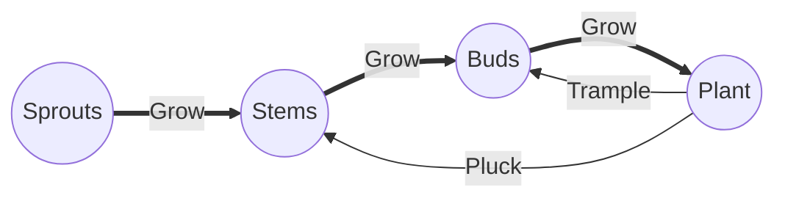

* Contents
{:toc}

# Links

* ![Bridge][][Flower Research Spreadsheet](https://docs.google.com/spreadsheets/d/1rbYbQ0i3SuTu30KTma5dO4uuJWr_SjOZXA1l4UOIHWo/edit#gid=528655130)
* ![Bridge][][Garden Science on the ACNH Discord](https://discord.gg/acnh)

# Disclaimer

![Warning][]This is a work in progress. Some wording may be inaccurate and mistakes can be present. Please contact me on Discord or Twitter for any question or suggestion.

# Introduction

Flowers are part of your island's natural vegetation, along with trees, weeds and mushrooms. 

They mostly serve as a decoration for your island, and increase its star rating. Once fully grown, they can also be plucked to serve as a crafting material.

Flowers exist in various species. Each species has three different basic colors, and more colors can be obtained by breeding.

Flowers also have hidden values called genes, which determine their color and their offspring's potential colors. A flower's color is called the phenotype, and the ensemble of its genes are called the genotype.

When flowers are watered, they will have a chance to reproduce on the next day, which will spawn a new flower next to its parent. 

> **![Warning][] Phenotype does not equal Genotype**
>
> * A flower's color is only a consequence of its genes.
> * In most cases, color only cannot tell you the flower's genes.
> * In most cases, color only cannot tell you the offspring's possible genes or colors.

> **![Warning][]Beware of Inaccurate Guides**
>
> For these reasons, any guide not taking genes into account will be inaccurate.
>
> * Most combinations will work only if both parents have the right genes.
> * Very few combinations might still work regardless of parents genes, but the chances of producing the desired offspring will vary greatly depending on them.
>
> It's advised to avoid any guide not mentioning genes.

> **![Warning][]Beware of Inaccurate Breeding Combinations**
>
> Here is a famous example of a breeding combination you can find online.
>
> |        Parent A         |        Parent B         |       Offspring        |
> | :---------------------: | :---------------------: | :--------------------: |
> | ![LM][] Purple Mum | ![LM][] Purple Mum | ![GM][] Green Mum |
>
> While this combination can work in some cases, it does not work with all Purple Mums.
>
> Specifically, the most common Purple Mums (`002`), which are bred using two White Mums (`001`/`012`), will never be able to produce a Green Mum.

# Flower Phenotypes

Flowers exist in eight different species, with each species existing in different phenotypes.

| Species    |  White  |  Pink   |   Red   | Orange  | Yellow  |  Green  |  Blue   | Purple  |  Black  |  Gold   |
| ---------- | :-----: | :-----: | :-----: | :-----: | :-----: | :-----: | :-----: | :-----: | :-----: | :-----: |
| Rose       | ![WR][] | ![PR][] | ![RR][] | ![OR][] | ![YR][] |         | ![UR][] | ![LR][] | ![BR][] | ![RG][] |
| Tulip      | ![WT][] | ![PT][] | ![RT][] | ![OT][] | ![YT][] |         |         | ![LT][] | ![BT][] |         |
| Pansy      | ![WP][] |         | ![RP][] | ![OP][] | ![YP][] |         | ![UP][] | ![LP][] |         |         |
| Cosmos     | ![WC][] | ![PC][] | ![RC][] | ![OC][] | ![YC][] |         |         |         | ![BC][] |         |
| Lily       | ![WL][] | ![PL][] | ![RL][] | ![OL][] | ![YL][] |         |         |         | ![BL][] |         |
| Hyacinth   | ![WH][] | ![PH][] | ![RH][] | ![OH][] | ![YH][] |         | ![UH][] | ![LH][] |         |         |
| Windflower | ![WW][] | ![PW][] | ![RW][] | ![OW][] |         |         | ![UW][] | ![LW][] |         |         |
| Mum        | ![WM][] | ![PM][] | ![RM][] |         | ![YM][] | ![GM][] |         | ![LM][] |         |         |

# Flower Tiers

Flowers from each species can be arranged according to their selling price, which is pretty consistent with their rarity.

|               |                     Base *                      |                   Tier 1 *                   |          Tier 2           |              Tier 3              |
| ------------- | :---------------------------------------------: | :------------------------------------------: | :-----------------------: | :------------------------------: |
| Selling Price |                   40![Coin][]                   |                 80![Coin][]                  |       240![Coin][]        |          1000![Coin][]           |
| Source        | Seeds Wild (Regular Islands) Breeding |   Wild (Rare Flower Islands) Breeding   |         Breeding          |             Breeding             |
| Generation ** |                        0                        |                      1                       | 1 (Roses) 2 (Others) | 2 (Gold Rose) 3 (Blue Rose) |
| Rose          | ![WR][]![YR][]![RR][] `0010` `0200` `2001` |      ![PR][]![OR][] `2022` `2211`       |      ![LR][]![BR][]       |          ![UR][]![RG][]          |
| Tulip         |  ![WT][]![YT][]![RT][] `001` `020` `201`   | ![PT][]![OT][]![BT][] `101` `120` `210` |          ![LT][]          |                                  |
| Pansy         |  ![WP][]![YP][]![RP][] `001` `020` `200`   |       ![OP][]![UP][] `221` `102`        |          ![LP][]          |                                  |
| Cosmos        |  ![WC][]![YC][]![RC][] `001` `021` `200`   |       ![PC][]![OC][] `112` `211`        |          ![BC][]          |                                  |
| Lily          |  ![WL][]![YL][]![RL][] `002` `020` `201`   | ![PL][]![OL][]![BL][] `212` `221` `210` |                           |                                  |
| Hyacinth      |  ![WH][]![YH][]![RH][] `001` `020` `201`   | ![PH][]![OH][]![UH][] `101` `120` `210` |          ![LH][]          |                                  |
| Windflower    |  ![WW][]![OW][]![RW][] `001` `020` `200`   |       ![PW][]![UW][] `221` `102`        |          ![LW][]          |                                  |
| Mum           |  ![WM][]![YM][]![RM][] `001` `020` `200`   |       ![PM][]![LM][] `112` `211`        |          ![GM][]          |                                  |

\* Numbers under Base and Tier 1 flowers are the default genotype for seeds and wild flowers.

\*\* Minimal number of generations required to breed from seeds

# Flower Growth

Flowers have four different growth stages. On every new day, all flowers not placed on beach sand will grow to their next stage, regardless if they watered or not.

| Growth Stage | Growth Stage Name | Able to Reproduce |
| ------------ | ----------------- | :---------------: |
| Stage 1      | Sprouts           |        No         |
| Stage 2      | Stems             |        No         |
| Stage 3      | Buds              |        Yes        |
| Stage 4      | Plant             |        Yes        |

* Planting flower seeds spawns new sprouts on the tile they are used on.
* When reproducing, a flower spawns new buds on an adjacent tile.
* Plucking a plant reverts it to stems.
* Trampling a plant reverts it to buds.

# Flower Calendar

Each month of the year has a pool of monthly available flower species. There is a six-month shift between the two hemispheres.

Timmy and Tommy will always sell one of the monthly species, while Leif will sell two of the non-monthly species.

| Species    | Jan Jul | Feb Aug | Mar Sep | Apr Oct | May Nov | Jun Dec | Jul Jan | Aug Feb | Sep Mar | Oct Apr | Nov May | Dec Jun |
| ---------- | :----------: | :----------: | :----------: | :----------: | :----------: | :----------: | :----------: | :----------: | :----------: | :----------: | :----------: | :----------: |
| Rose       |              |              |              |              |      ✓       |      ✓       |      ✓       |              |              |      ✓       |      ✓       |      ✓       |
| Tulip      |              |              |      ✓       |      ✓       |      ✓       |      ✓       |              |              |              |              |              |              |
| Pansy      |      ✓       |      ✓       |      ✓       |      ✓       |              |              |              |              |              |              |      ✓       |      ✓       |
| Cosmos     |              |              |              |              |              |              |      ✓       |      ✓       |      ✓       |      ✓       |      ✓       |              |
| Lily       |              |              |              |              |              |      ✓       |      ✓       |      ✓       |      ✓       |              |              |              |
| Hyacinth   |              |      ✓       |      ✓       |      ✓       |              |              |              |              |              |              |              |              |
| Windflower |      ✓       |      ✓       |      ✓       |      ✓       |      ✓       |              |              |              |              |              |              |      ✓       |
| Mum        |      ✓       |              |              |              |              |              |              |      ✓       |      ✓       |      ✓       |      ✓       |      ✓       |

\* First line is the month for Northern Hemisphere, second line is the month for Southern Hemisphere.

# Flower Acquisition

There are three different ways of obtaining flowers.

* Wild flowers are naturally generated when an island is created.
* Base flower seeds can be bought at shops or found in the Resident Services bin.
* Flowers can reproduce and spawn new flowers.

Wild and seed flowers have a fixed default genotype, which makes them the only reliable way for starting flower breeding.

## Specialty & Village Flowers

Every island has a specialty flower and a village flower. They are determined when the island is created, based on the main player's birth month and the current month. They will always be two different species, even if the island's creation month and the main player's birth month share common flower species.

* Specialty flower will spawn naturally on the island cliffs on its creation.
* Village flower will always be sold at the shop.
* Both will be the only species to appear on mystery islands.

| Official Name    | Unofficial Name               | Determined by             | Found on                                             |
| ---------------- | ----------------------------- | ------------------------- | ---------------------------------------------------- |
| Specialty Flower | Main Flower                   | Main Player's Birth Month | Main Island Mystery Islands Nooklings Shop |
| Village Flower   | Sub Flower Sister Flower | Island's Creation Month   | Mystery Islands Nooklings Shop                  |

## Wild Flowers

Wild flowers are naturally generated when an island is created. They will always have their default genotype.

* Main island will spawn base color specialty flowers on the cliffs upon creation.
* Mystery islands will spawn base (95%) or tier one (5%) of either specialty or village flowers (50% each).

> ![Warning][]**Main Island Wild Flowers**
>
> By the time you are able to reach your main island's cliffs, the original wild flowers there might have already reproduced and bred because of rain. In this case, you will not be able to know which ones have their default genotype. Because of this, it is advised to not use any of your original cliff flowers which has adjacent flowers.
>
> If you want already-grown flowers to use as a quick replacement for seed flowers, you can use wild flowers from mystery islands instead.

## Seed Flowers

Base flower seeds can be bought at shops. Flowers grown from them will always have their default genotypes.

* Nook Shop sells your village flower species and another species (specialty or monthly not confirmed).
* Nook's Cranny also sells a third monthly flower species, different from your specialty and village flowers. It rotates every week on Mondays (not confirmed).
* Leif sells two flower species randomly chosen from those unavailable during the current month (not confirmed).

# Watering

Flowers have a hidden water counter which determine their current reproduction chances. Flowers which have been watered on the current day will have their countered increased on the next day, and will have a chance at reproducing if they are buds (stage 3) or plants (stage 4).

# Reproduction

Flower buds (stage 3) and plants (stage 4) can reproduce, creating a new flower on adjacent available tiles. On every new day, all watered buds and plants not placed on beach sand will have a chance of reproducing.

| Growth Stage | Growth Stage Name | Able to Reproduce |
| ------------ | ----------------- | :---------------: |
| Stage 1      | Sprout            |        No         |
| Stage 2      | Stems             |        No         |
| Stage 3      | Buds              |        Yes        |
| Stage 4      | Plant             |        Yes        |

## Base Reproduction Chance

Base reproduction chance starts at 5%.

Each flower has a water counter keeping track of the number of days it was watered without reproducing. Starting from a water counter of 4 onwards, the base reproduction chance increases by 5% for each additional day of watering. The water counter is reset to 0 when the flower reproduces or if it is dug up.

| Water Counter | Base Reproduction Chance |
| ------------- | :----------------------: |
| 0-3           |            5%            |
| 4             |           10%            |
| 5             |           15%            |
| 6             |           20%            |
| ...           |           ...            |
| 20+           |           90%            |

## Bonus Reproduction Chance

Bonus reproduction chance is added when visitors from other islands water your flowers.

Each flower has a watering visitor counter keeping track of the number of players from other islands who watered it during the current day. Only the 10 first watering visitors of the day will be counted. Visitors who don't water any flower will not count toward this limit. The watering visitor counter is reset to 0 everyday or when the flower is dug up.

| Visitor Counter | Bonus Reproduction Chance |
| --------------- | :-----------------------: |
| 1               |            20%            |
| 2               |            30%            |
| 3               |            45%            |
| 4               |            60%            |
| 5+              |            75%            |

## Average Reproduction Chance

In the long run, the odds can be approximated without taking the water counter's exact value into account.

| Watering Visitors | Single Flower Rep. Chance | Flower Pair Rep. Chance |
| :---------------- | :-----------------------: | :---------------------: |
| 0                 |           14.8%           |          19.9%          |
| 1                 |           28.9%           |          45.5%          |
| 2                 |           37.3%           |          58.3%          |
| 3                 |           50.9%           |          75.1%          |
| 4                 |           65.3%           |          87.8%          |
| 5+                |            80%            |           96%           |

> Calculations by Chomp

## Breeding or Replication

When flowers reproduce, they can either breed or duplicate depending on their surroundings.

| Context              | Reproduction Mode | Offspring                |
| -------------------- | ----------------- | ------------------------ |
| Available Partner    | Breeding          | Child of both parents    |
| No Available Partner | Duplication       | Exact copy of the parent |

## Reproduction Algorithm

1. If A is watered, increment its water counter and roll for reproduction.
2. If successful, search for a random adjacent eligible tile T.
3. If successful, search for a random adjacent eligible partner B.
4. If successful, breed with B and produce the offspring C on T.
   If unsuccessful, replicate and produce the duplicate C on T.
5. Either way, reset the water counter of all involved flowers and mark them ineligible for the rest of the algorithm.

Reproduction Algorithm from <a href="https://gardenscience.ac/">Aeon</a>

# Genes

Genes are four hidden values attached to each flower. Together, they define the flower's genotype, which determines the flower's phenotype. Only Roses use all four genes, other flower species only use the first three genes.

Genes have been given an unofficial name and code to make communication and notation easier.

| Gene   | Name                              | Influence on Phenotype                                       |
| ------ | --------------------------------- | ------------------------------------------------------------ |
| Gene 1 | `R` (Red)                         | Generally affects the flower's red color level               |
| Gene 2 | `Y` (Yellow)                      | Generally affects the flower's yellow color level            |
| Gene 3 | `W` (White)                       | Generally affects the flower's white color level             |
| Gene 4 | `B` (Brightness) `S` (Shade) | Roses only Generally affects the flower's red color brightness |

Each individual gene has a value, which can be represented in various ways.

* Trinary notation is how the gene is coded in the genotype table.
* Binary notation is how the gene is coded in a flower's attributes.
* Genetic notation is an unofficial notation used by some players.

| Trinary Value | Binary Value | Genetic Value                  | Influence on Phenotype |
| ------------- | ------------ | ------------------------------ | ---------------------- |
| `0`           | `00`         | `rr`, `yy`,  `ww`, `bb` / `ss` | Low                    |
| `1`           | `01`         | `Rr`, `Yy`, `Ww`, `Bb` / `Ss`  | Mid                    |
| `2`           | `11`         | `RR`, `YY`, `WW`, `BB` / `SS`  | High                   |

> ![Warning][]Genotype to Phenotype
>
> Keep in mind that the relation at play between genotype and phenotype is ambiguous, inconsistent, and varies between different flower species.
>
> The gene expression system used by the game actually makes less sense than real-life genetics.

> ![Warning][]Equivalence between `01` and `10` / `Xx` and `xX`
>
> Note that binary `10` is always noted `01` since those two distributions are equivalent.
>
> Similarly, `xX` is always noted `Xx` for genetic notation.

> ![Warning][]Gene 3 Inverted Genetic Notation
>
> In genetic notation, Gene 3 is sometimes inverted for the sake of conforming to real-life genetic notation norms. When this is the case, `ww` is written as `WW` and `WW` is written as `ww`.
>
> Paleh's Advanced Genetics Guide is the main source where this notation is used.

**Genotype Example**

Here are different notations for the genotype of a rose.

| Species | Trinary Genotype | Binary Genotype | Genetic Genotype |
| :-----: | :--------------: | :-------------: | :--------------: |
|  Rose   |      `2001`      |   `11000001`    |    `RRyywwBb`    |

Here are this red rose's corresponding gene values in different notations.

| Gene   | Trinary Value | Binary Value | Genetic Value | Influence on Phenotype |
| ------ | ------------- | ------------ | ------------- | ---------------------- |
| Gene 1 | `2`           | `11`         | `RR`          | High                   |
| Gene 2 | `0`           | `00`         | `yy`          | Low                    |
| Gene 3 | `0`           | `00`         | `ww`          | Low                    |
| Gene 4 | `1`           | `01`         | `Bb`          | Mid                    |

By looking at the genotype table for roses, you will see that this corresponds to a red rose.

> This rose's genotype can be read as "high red, mid red brightness", which indeed makes red. However, keep in mind that the there are no known clear rules for translating genotype to phenotype, so just use the genotype table to know what phenotype corresponds to a particular genotype.

# Genotype Table

This table shows all the 270 different flowers.

Roses have 81 possible genotypes, other flower species have 27.

|  G1  |  G2  |  G3  | Rose G4 0 | Rose G4 1 | Rose G4 2 |   Tulip   |   Pansy   |  Cosmos   |   Lily    | Hyacinth  | Windflower |    Mum    |
| :--: | :--: | :--: | :-------: | :-------: | :-------: | :-------: | :-------: | :-------: | :-------: | :-------: | :--------: | :-------: |
|  0   |  0   |  0   | ![WR][WR] | ![WR][WR] | ![WR][WR] | ![WT][WT] | ![WP][WP] | ![WC][WC] | ![WL][WL] | ![WH][WH] | ![WW][WW]  | ![WM][WM] |
|  0   |  0   |  1   | ![WR][WR] | ![WR][WR] | ![WR][WR] | ![WT][WT] | ![WP][WP] | ![WC][WC] | ![WL][WL] | ![WH][WH] | ![WW][WW]  | ![WM][WM] |
|  0   |  0   |  2   | ![LR][LR] | ![LR][LR] | ![LR][LR] | ![WT][WT] | ![UP][UP] | ![WC][WC] | ![WL][WL] | ![UH][UH] | ![UW][UW]  | ![LM][LM] |
|  0   |  1   |  0   | ![YR][YR] | ![YR][YR] | ![YR][YR] | ![YT][YT] | ![YP][YP] | ![YC][YC] | ![YL][YL] | ![YH][YH] | ![OW][OW]  | ![YM][YM] |
|  0   |  1   |  1   | ![WR][WR] | ![WR][WR] | ![WR][WR] | ![YT][YT] | ![YP][YP] | ![YC][YC] | ![WL][WL] | ![YH][YH] | ![OW][OW]  | ![YM][YM] |
|  0   |  1   |  2   | ![LR][LR] | ![LR][LR] | ![LR][LR] | ![WT][WT] | ![UP][UP] | ![WC][WC] | ![WL][WL] | ![WH][WH] | ![UW][UW]  | ![WM][WM] |
|  0   |  2   |  0   | ![YR][YR] | ![YR][YR] | ![YR][YR] | ![YT][YT] | ![YP][YP] | ![YC][YC] | ![YL][YL] | ![YH][YH] | ![OW][OW]  | ![YM][YM] |
|  0   |  2   |  1   | ![YR][YR] | ![YR][YR] | ![YR][YR] | ![YT][YT] | ![YP][YP] | ![YC][YC] | ![YL][YL] | ![YH][YH] | ![OW][OW]  | ![YM][YM] |
|  0   |  2   |  2   | ![WR][WR] | ![WR][WR] | ![WR][WR] | ![YT][YT] | ![YP][YP] | ![YC][YC] | ![WL][WL] | ![YH][YH] | ![OW][OW]  | ![YM][YM] |
|  1   |  0   |  0   | ![RR][RR] | ![PR][PR] | ![WR][WR] | ![RT][RT] | ![RP][RP] | ![PC][PC] | ![RL][RL] | ![RH][RH] | ![RW][RW]  | ![PM][PM] |
|  1   |  0   |  1   | ![RR][RR] | ![PR][PR] | ![WR][WR] | ![PT][PT] | ![RP][RP] | ![PC][PC] | ![PL][PL] | ![PH][PH] | ![RW][RW]  | ![PM][PM] |
|  1   |  0   |  2   | ![RR][RR] | ![PR][PR] | ![LR][LR] | ![WT][WT] | ![UP][UP] | ![PC][PC] | ![WL][WL] | ![WH][WH] | ![UW][UW]  | ![PM][PM] |
|  1   |  1   |  0   | ![OR][OR] | ![YR][YR] | ![YR][YR] | ![OT][OT] | ![OP][OP] | ![OC][OC] | ![OL][OL] | ![OH][OH] | ![PW][PW]  | ![YM][YM] |
|  1   |  1   |  1   | ![RR][RR] | ![PR][PR] | ![WR][WR] | ![YT][YT] | ![OP][OP] | ![OC][OC] | ![YL][YL] | ![YH][YH] | ![PW][PW]  | ![RM][RM] |
|  1   |  1   |  2   | ![RR][RR] | ![PR][PR] | ![LR][LR] | ![YT][YT] | ![OP][OP] | ![PC][PC] | ![YL][YL] | ![YH][YH] | ![PW][PW]  | ![PM][PM] |
|  1   |  2   |  0   | ![OR][OR] | ![YR][YR] | ![YR][YR] | ![OT][OT] | ![YP][YP] | ![OC][OC] | ![OL][OL] | ![OH][OH] | ![OW][OW]  | ![LM][LM] |
|  1   |  2   |  1   | ![OR][OR] | ![YR][YR] | ![YR][YR] | ![YT][YT] | ![YP][YP] | ![OC][OC] | ![YL][YL] | ![YH][YH] | ![OW][OW]  | ![LM][LM] |
|  1   |  2   |  2   | ![RR][RR] | ![PR][PR] | ![WR][WR] | ![YT][YT] | ![YP][YP] | ![OC][OC] | ![YL][YL] | ![YH][YH] | ![OW][OW]  | ![LM][LM] |
|  2   |  0   |  0   | ![BR][BR] | ![RR][RR] | ![PR][PR] | ![BT][BT] | ![RP][RP] | ![RC][RC] | ![BL][BL] | ![RH][RH] | ![RW][RW]  | ![RM][RM] |
|  2   |  0   |  1   | ![BR][BR] | ![RR][RR] | ![PR][PR] | ![RT][RT] | ![RP][RP] | ![RC][RC] | ![RL][RL] | ![RH][RH] | ![RW][RW]  | ![RM][RM] |
|  2   |  0   |  2   | ![BR][BR] | ![RR][RR] | ![PR][PR] | ![RT][RT] | ![LP][LP] | ![RC][RC] | ![PL][PL] | ![RH][RH] | ![LW][LW]  | ![RM][RM] |
|  2   |  1   |  0   | ![OR][OR] | ![OR][OR] | ![YR][YR] | ![BT][BT] | ![RP][RP] | ![OC][OC] | ![BL][BL] | ![UH][UH] | ![RW][RW]  | ![LM][LM] |
|  2   |  1   |  1   | ![RR][RR] | ![RR][RR] | ![WR][WR] | ![RT][RT] | ![RP][RP] | ![OC][OC] | ![RL][RL] | ![RH][RH] | ![RW][RW]  | ![LM][LM] |
|  2   |  1   |  2   | ![BR][BR] | ![RR][RR] | ![LR][LR] | ![RT][RT] | ![LP][LP] | ![RC][RC] | ![PL][PL] | ![RH][RH] | ![LW][LW]  | ![RM][RM] |
|  2   |  2   |  0   | ![OR][OR] | ![OR][OR] | ![YR][YR] | ![LT][LT] | ![OP][OP] | ![BC][BC] | ![OL][OL] | ![LH][LH] | ![PW][PW]  | ![GM][GM] |
|  2   |  2   |  1   | ![OR][OR] | ![OR][OR] | ![YR][YR] | ![LT][LT] | ![OP][OP] | ![BC][BC] | ![OL][OL] | ![LH][LH] | ![PW][PW]  | ![GM][GM] |
|  2   |  2   |  2   | ![UR][UR] | ![RR][RR] | ![WR][WR] | ![LT][LT] | ![LP][LP] | ![RC][RC] | ![WL][WL] | ![LH][LH] | ![LW][LW]  | ![RM][RM] |

### Breeding Algorithm

When two flowers of the same species breed together, their genotypes combine to create the offspring's genotype.

The algorithm used to determine the offspring's genotype is based on a real-life genetic principle called Mendelian Inheritance. Binary or Genetic notations are used here.

1. Make a copy of each parent's gene X
2. Cut both copies in half
3. Choose one random half from each parent
4. Combine the two halves to create the offspring's gene X

Possible outcomes for the offspring gene may be represented by a simple diagram called Punnett Square.

## Breeding Example

Let's breed these two flowers.

|              Parent A              |              Parent B              |
| :--------------------------------: | :--------------------------------: |
| ![OP][] `111101` (`221`) | ![UP][] `010011` (`102`) |

Before starting, let's cut each gene in half.

| Gene   | Parent A           | Parent B           |
| ------ | ------------------ | ------------------ |
| Gene 1 | `11` → `1` and `1` | `01` → `0` and `1` |
| Gene 2 | `11` → `1` and `1` | `00` → `0` and `0` |
| Gene 3 | `01` → `0` and `1` | `11` → `1` and `1` |

![Cursor][]First, let's make the Punnett Square for Gene 1.

|                    | Parent A gives `1` | Parent A gives `1` |
| ------------------ | ------------------ | ------------------ |
| Parent B gives `0` | `01`               | `01`               |
| Parent B gives `1` | `11`               | `11`               |

Offspring Gene 1 will be `01` or `11` (50% chance each).

![Cursor][]Second, let's make the Punnett Square for Gene 2.

|                    | Parent A gives `1` | Parent A gives `1` |
| ------------------ | ------------------ | ------------------ |
| Parent B gives `0` | `01`               | `01`               |
| Parent B gives `0` | `01`               | `01`               |

Offspring Gene 2 will be `01` (100% chance).

![Cursor][]Third, let's make the Punnett Square for Gene 3.

|                    | Parent A gives `0` | Parent A gives `1` |
| ------------------ | ------------------ | ------------------ |
| Parent B gives `1` | `01`               | `11`               |
| Parent B gives `1` | `01`               | `11`               |

Offspring Gene 3 will be `01` or `11` (50% chance each).

![Cursor][]Finally, we can make a giant Punnett Square to see all the possible combinations.

|                                 |  Parent A gives `1`+`1`+`0`   |  Parent A gives `1`+`1`+`1`   |  Parent A gives `1`+`1`+`0`   |  Parent A gives `1`+`1`+`1`   |  Parent A gives `1`+`1`+`0`   |  Parent A gives `1`+`1`+`1`   |  Parent A gives `1`+`1`+`0`   |  Parent A gives `1`+`1`+`1`   |
| :-----------------------------: | :--------------------------------: | :--------------------------------: | :--------------------------------: | :--------------------------------: | :--------------------------------: | :--------------------------------: | :--------------------------------: | :--------------------------------: |
| Parent B gives `0`+`0`+`1` | ![OP][] `010101` (`111`) | ![OP][] `010111` (`112`) | ![OP][] `010101` (`111`) | ![OP][] `010111` (`112`) | ![OP][] `010101` (`111`) | ![OP][] `010111` (`112`) | ![OP][] `010101` (`111`) | ![OP][] `010111` (`112`) |
| Parent B gives `0`+`0`+`1` | ![OP][] `010101` (`111`) | ![OP][] `010111` (`112`) | ![OP][] `010101` (`111`) | ![OP][] `010111` (`112`) | ![OP][] `010101` (`111`) | ![OP][] `010111` (`112`) | ![OP][] `010101` (`111`) | ![OP][] `010111` (`112`) |
| Parent B gives `0`+`0`+`1` | ![OP][] `010101` (`111`) | ![OP][] `010111` (`112`) | ![OP][] `010101` (`111`) | ![OP][] `010111` (`112`) | ![OP][] `010101` (`111`) | ![OP][] `010111` (`112`) | ![OP][] `010101` (`111`) | ![OP][] `010111` (`112`) |
| Parent B gives `0`+`0`+`1` | ![OP][] `010101` (`111`) | ![OP][] `010111` (`112`) | ![OP][] `010101` (`111`) | ![OP][] `010111` (`112`) | ![OP][] `010101` (`111`) | ![OP][] `010111` (`112`) | ![OP][] `010101` (`111`) | ![OP][] `010111` (`112`) |
| Parent B gives `1`+`0`+`1` | ![RP][] `110101` (`211`) | ![LP][] `110111` (`212`) | ![RP][] `110101` (`211`) | ![LP][] `110111` (`212`) | ![RP][] `110101` (`211`) | ![LP][] `110111` (`212`) | ![RP][] `110101` (`211`) | ![LP][] `110111` (`212`) |
| Parent B gives `1`+`0`+`1` | ![RP][] `110101` (`211`) | ![LP][] `110111` (`212`) | ![RP][] `110101` (`211`) | ![LP][] `110111` (`212`) | ![RP][] `110101` (`211`) | ![LP][] `110111` (`212`) | ![RP][] `110101` (`211`) | ![LP][] `110111` (`212`) |
| Parent B gives `1`+`0`+`1` | ![RP][] `110101` (`211`) | ![LP][] `110111` (`212`) | ![RP][] `110101` (`211`) | ![LP][] `110111` (`212`) | ![RP][] `110101` (`211`) | ![LP][] `110111` (`212`) | ![RP][] `110101` (`211`) | ![LP][] `110111` (`212`) |
| Parent B gives `1`+`0`+`1` | ![RP][] `110101` (`211`) | ![LP][] `110111` (`212`) | ![RP][] `110101` (`211`) | ![LP][] `110111` (`212`) | ![RP][] `110101` (`211`) | ![LP][] `110111` (`212`) | ![RP][] `110101` (`211`) | ![LP][] `110111` (`212`) |

Offspring genotype will be `010101`, `010111`, `110101` or `110111` (25% chance each).

![Cursor][]Now we know the exact possible outcomes for this breeding pair.

|              Parent A               |              Parent B               |             Offspring              | Chance |
| :---------------------------------: | :---------------------------------: | :--------------------------------: | :----: |
| ![OP][]  `111101` (`221`) | ![UP][]  `010011` (`102`) | ![OP][] `010101` (`111`) |  25%   |
| ![OP][]  `111101` (`221`) | ![UP][]  `010011` (`102`) | ![OP][] `010111` (`112`) |  25%   |
| ![OP][]  `111101` (`221`) | ![UP][]  `010011` (`102`) | ![RP][] `110101` (`211`) |  25%   |
| ![OP][]  `111101` (`221`) | ![UP][]  `010011` (`102`) | ![LP][] `110111` (`212`) |  25%   |

# Flags

Flags are hidden information attached to an item.

In the case of flowers, flags hold the flower's genes and various information about its state.

|              Flag               | Information                                                  | Function                                                     | Reset                                                        |
| :-----------------------------: | ------------------------------------------------------------ | ------------------------------------------------------------ | ------------------------------------------------------------ |
|     ![Memo][] Genotype     | The flower's 4 genetic values                                | Determines the flower's phenotype (color) and possible offspring | Never                                                        |
|  ![Time][] Water Counter   | Number of days the flower was watered without reproducing    | Increases the base reproduction chance                       | If the flower reproduces If the flower is dug up (needs confirmation but likely) |
|   ![Can][] Regular Water   | Raised if the flower was watered that day                    | On a new day : Increment the water counter by `1`Roll for reproduction | On a new day                                                 |
| ![Gold Can][] Golden Water | Raised if the flower was watered with a golden can           | If the flower is a Black Rose : Reproduction has 50% chances of spawning a Gold Rose | If the flower reproduces or spawns a gold rose (currently unknown) |
| ![Visitor][] Visitor Water | 10 flags referencing the first 10 visitors of the day Raised if the flower was watered by corresponding visitor | Increases the bonus reproduction chance                      | On a new day If the flower is dug up                     |

> ![Book][] Flags : Raised or Reset
>
> * Raising a flag can be seen as activating it, giving it a non-zero numeric value or the boolean value `True`.
> * Resetting a flag can be seen as deactivating it, giving it a zero numeric value or the boolean value `False`.

**Flag Example**

Let's take a look at a particular flower and its flags.

|      Flower       |       Genotype        |   Water Counter    |     Regular Water     |       Golden Water        |          Visitor Water          |
| :---------------: | :-------------------: | :----------------: | :-------------------: | :-----------------------: | :-----------------------------: |
| ![BR][] Rose | ![Memo][] `2020` | ![Time][] `4` | ![Can][] `False` | ![Gold Can][] `True` | ![Visitor][] All : `False` |

Here is how we can interpret this flower's flags.

|              Flag               |     Value     | Meaning                                                      | Consequence                                                  |
| :-----------------------------: | :-----------: | ------------------------------------------------------------ | ------------------------------------------------------------ |
|     ![Memo][] Genotype     |    `2020`     | This flower's genes are : Gene 1: `2`, Gene 2 : `0`, Gene 3 : `2`, Gene 4 :  `0`.  | For Roses, this genotype corresponds to a Black phenotype. Hence, this Rose is Black. |
|  ![Time][] Water Counter   |      `4`      | This flower has been watered during 4 days without reproducing. | This flower's base reproduction chance is currently 10%.     |
|   ![Can][] Regular Water   |    `False`    | This flower has not been watered during the current day.     | When a new day comes, this flower's water counter will not be incremented and the flower will not roll for reproduction |
| ![Gold Can][] Golden Water |    `True`     | This flower has been watered with a golden can.              | Since this flower is a Black Rose, when it will reproduce, the offspring will have a 50% chance of being a Gold Rose. |
|    ![Visitor][]Visitor Water    | All : `False` | This flower has not been watered by any of the current day's first 10 visitors. | This flower has no reproduction chance bonus.                |

Some observations :

* This flower's current reproduction chance is 10% (10% base + 0% bonus). However, when it gets watered, then on a new day the water counter will be incremented to `5` just before rolling for reproduction, which will increase the reproduction chance to 15% (15% base + 0% bonus).
* Since the golden water flag is raised and the regular water flag is not, it means that this flower has been watered by a golden can on a previous day.

# Weeds

## Weed Spawning

![Weed][]Weeds spawn naturally on islands, as long as their total population is inferior 150.

Every day, a number of new weeds will spawn depending on the current number of weeds on the island.

| Current Number of Weeds | New Weeds per Day |
| :---------------------- | :---------------: |
| 0 - 30                  |         2         |
| 31 - 149                |         1         |
| 150                     |         0         |

## Weed Growth

Weeds have three growth stages. When they spawn, they are at the first stage.

Every day, weeds have a chance of growing to their next stage depending on their current stage and their watered state.

| Growth Stage      | Growth Chance, Unwatered | Growth Chance, Watered |
| :---------------- | :----------------------: | :--------------------: |
| Stage 1 → Stage 2 |           20%            |          50%           |
| Stage 2 → Stage 3 |            5%            |          10%           |

## Weed Spreading

Weeds can also spread, spawning new weeds on adjacent empty tiles, additionally to the default weed spawning.

Every day, weeds have a chance to spread depending on their current growth stage and their watered state.

| Growth Stage | Spreading Chance, Unwatered | Spreading Chance, Watered |
| :----------- | :-------------------------: | :-----------------------: |
| Stage 1      |             0%              |            5%             |
| Stage 2      |             10%             |            20%            |
| Stage 3      |             80%             |           100%            |

[WR]: ../img/icon/RW.png "White Rose"
[RR]: ../img/icon/RR.png "Red Rose"
[YR]: ../img/icon/RY.png "Yellow Rose"
[PR]: ../img/icon/RP.png "Pink Rose"
[OR]: ../img/icon/RO.png "Orange Rose"
[LR]: ../img/icon/RU.png "Purple Rose"
[BR]: ../img/icon/RK.png "Black Rose"
[UR]: ../img/icon/RB.png "Blue Rose"
[RG]: ../img/icon/RG.png "Gold Rose"
[WT]: ../img/icon/TW.png "White Tulip"
[RT]: ../img/icon/TR.png "Red Tulip"
[YT]: ../img/icon/TY.png "Yellow Tulip"
[PT]: ../img/icon/TP.png "Pink Tulip"
[OT]: ../img/icon/TO.png "Orange Tulip"
[LT]: ../img/icon/TU.png "Purple Tulip"
[BT]: ../img/icon/TK.png "Black Tulip"

[WP]: ../img/icon/PW.png "White Pansy"
[RP]: ../img/icon/PR.png "Red Pansy"
[YP]: ../img/icon/PY.png "Yellow Pansy"
[OP]: ../img/icon/PO.png "Orange Pansy"
[LP]: ../img/icon/PU.png "Purple Pansy"
[UP]: ../img/icon/PB.png "Blue Pansy"

[RC]: ../img/icon/CR.png "Red Cosmos"
[WC]: ../img/icon/CW.png "White Cosmos"
[YC]: ../img/icon/CY.png "Yellow Cosmos"
[BC]: ../img/icon/CK.png "Black Cosmos"
[OC]: ../img/icon/CO.png "Orange Cosmos"
[PC]: ../img/icon/CP.png "Pink Cosmos"

[WL]: ../img/icon/LW.png "White Lily"
[RL]: ../img/icon/LR.png "Red Lily"
[YL]: ../img/icon/LY.png "Yellow Lily"
[PL]: ../img/icon/LP.png "Pink Lily"
[OL]: ../img/icon/LO.png "Orange Lily"
[BL]: ../img/icon/LK.png "Black Lily"

[RH]: ../img/icon/HR.png "Red Hyacinth"
[WH]: ../img/icon/HW.png "White Hyacinth"
[YH]: ../img/icon/HY.png "Yellow Hyacinth"
[LH]: ../img/icon/HU.png "Purple Hyacinth"
[OH]: ../img/icon/HO.png "Orange Hyacinth"
[PH]: ../img/icon/HP.png "Pink Hyacinth"
[UH]: ../img/icon/HB.png "Blue Hyacinth"

[RW]: ../img/icon/WR.png "Red Windflower"
[WW]: ../img/icon/WW.png "White Windflower"
[UW]: ../img/icon/WB.png "Blue Windflower"
[LW]: ../img/icon/WU.png "Purple Windflower"
[PW]: ../img/icon/WP.png "Pink Windflower"
[OW]: ../img/icon/WO.png "Orange Windflower"

[RM]: ../img/icon/MR.png "Red Mum"
[WM]: ../img/icon/MW.png "White Mum"
[YM]: ../img/icon/MY.png "Yellow Mum"
[LM]: ../img/icon/MU.png "Purple Mum"
[PM]: ../img/icon/MP.png "Pink Mum"
[GM]: ../img/icon/MG.png "Green Mum"
[LOTV]: ../img/icon/LOTV.png "Lily of the Valley"
[Warning]: ../img/icon/Pitfall.png
[Can]: ../img/icon/Can.png
[Gold Can]: ../img/icon/CanGold.png
[Book]: ../img/icon/Book.png
[News]: ../img/icon/Post.png
[Gift]: ../img/icon/Present.png
[Shovel]: ../img/icon/Shovel.png
[Time]: ../img/icon/Timer.png
[Memo]: ../img/icon/Memo.png
[Visitor]: ../img/icon/ExpGreeting.png
[Cursor]: ../img/icon/HandRight.png

[Seeds]: ../img/icon/SW.png
[Bridge]: ../img/icon/Bridge.png

[Weed]: ../img/icon/Weed.png
[Coin]:../img/icon/Coin.png "Bells"
[RepAlg]: ../img/repalg.png	"Reproduction Algorithm"