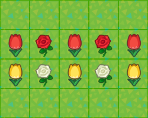
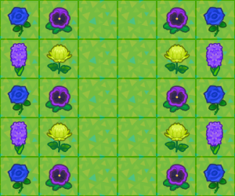

Learn the basics of flower mechanics and obtain all the flowers you want easily.

* Contents
{:toc}
# Simple Farming Instructions

Even though the flower mechanics are very deep, you can farm all the flowers you want easily and efficiently by following these very simple instructions.

## Farming Summary

You have to start with flowers coming from seeds or mystery islands to ensure they have the right genes. Breed them together to get new colors, and once you get a new flower with a color you want, just clone it again and again.

| Step | Instructions                                                 |
| :--: | ------------------------------------------------------------ |
| 1 ![SW][] | Grow new flowers from seeds or bring wild flowers from mystery islands → Once the flower is grown enough, it will be able to reproduce → Visual tip : if the flower's color is visible, it's grown enough |
| 2 ![Shovel][] | Put your flowers in [breeding fields](#simple-breeding-fields) to get new colors → Follow the breeding combinations and layouts shown in this guide |
| 3 ![Shovel][] | Once you get a flower with the color you want, put it in a [cloning field](#simple-cloning-fields) → Follow the cloning layouts shown in this guide |
| 4 ![BP][] | Have your flowers hydrated once a day by watering can or rain → Once the flower is hydrated and will have a chance to reproduce → Visual tip : if the flower is making small sparkles, it's hydrated |
| 5 ![BP][] | Have up to five visitors water your flowers to speed up the process → Visitor watering will increase the reproduction chance for this day → Visual tip : if the flower is making big sparkles, it's watered by five visitors |

## Daily Farming Routine

Every day at 5:00 AM, the daily refresh takes place. Flowers will grow, and grown flowers which have been hydrated during the day will have a chance to reproduce. Follow this routine every day to farm your flowers efficiently.

| Step | Instructions                                                 |
| :--: | ------------------------------------------------------------ |
| 1  | After 5:00 AM : Check your farming fields |
| 2 ![Shovel][] | Dig the new children up and move them away → Move to a breeding field if you need them for a recipe → Move to a cloning field if you want more of them → Get rid of them if you have no use for them |
| 3 ![Shovel][] | Optional : Update your farming fields if needed → Make sure everything is in its right place before inviting watering visitors |
| 4 ![IWC][] | Optional : Have up to five visitors water your farming fields → Visitor watering will increase the reproduction chance for this day → Don't move your flowers after this or their bonus will be reset |
| 5 ![IWC][] | Before 5:00 AM : Water the farming fields → Not needed if it has rained or you had watering visitors → Keep this task for the end of the day in case it rains or you have visitors |

# Simple Breeding Fields

Use breeding to get new colors. If you already have a flower of the color you want, it's always better to clone it instead of breeding it.

When breeding, the two parent flowers will mix their genes and give birth to a new child flower, which may have different genes and colors from its parents.

The simplest way to breed two flowers is to put them next to each other as an isolated pair, not touching any other flower of their species. You can add another species in between pairs to make efficient use of the available space.

|                  Single Species Breeding                   |                 Multiple Species Breeding                  |
| :--------------------------------------------------------: | :--------------------------------------------------------: |
|  |  |

# Simple Breeding Combinations

There are a lot of possible flower combinations, with each one having multiple possible outcomes. The recipes shown in this guide are balanced to be both simple and effective. Just make sure to follow these very important rules when breeding.

|                Rule                 | Instruction                                                  |
| :---------------------------------: | ------------------------------------------------------------ |
|   1    | Always use the proper parents ![SW][]→ Parent from seeds or mystery islands ![NM][]→ Parent from mystery islands, some can be obtained from breeding ![IWC][]→ Parent from breeding, must have the right numbers |
| 2   | Always dig the new children up and move them away            |
| 3  | Never use the new children for breeding unless they appear in another recipe |

## Lilies

|       Parent        |       Parent        |                    Child                     |    Chance    |
| :-----------------: | :-----------------: | :------------------------------------------: | :----------: |
| ![][WL]![SW][]`002` | ![][RL]![SR][]`201` |             ![][PL]![BP][]`101`              |     50%      |
| ![][YL]![SY][]`020` | ![][RL]![SR][]`201` |             ![][OL]![BP][]`110`              |     50%      |
| ![][RL]![SR][]`201` | ![][RL]![SR][]`201` | ![][BL]![BP][]`200` ![][PL]![BP][]`202` | 25% 25% |

## Cosmos

|                    Parent                    |                    Parent                    |                            Child                             |              Chance               |
| :------------------------------------------: | :------------------------------------------: | :----------------------------------------------------------: | :-------------------------------: |
|             ![][WC]![SW][]`001`              |             ![][RC]![SR][]`200`              |         ![][PC]![BP][]`100` ![PC][]![BP][]`101`         |           50% 50%            |
|             ![][YC]![SY][]`021`              |             ![][RC]![SR][]`200`              |         ![][OC]![BP][]`110` ![OC][]![BP][]`111`         |           50% 50%            |
| ![][OC]![BP][]`110` ![OC][]![BP][]`111` | ![][OC]![BP][]`110` ![OC][]![BP][]`111` | ![][PC]![BP][]`100` ![][PC]![BP][]`101` ![][PC]![BP][]`102` ![][PC]![BP][]`112` ![][BC]![BP][]`220` ![BC][]![BP][]`221` | 12.5% ~ 18.75% 4.69% ~ 6.25% |
|             ![][OC]![NM][]`211`              |             ![][OC]![NM][]`211`              |         ![][BC]![BP][]`220` ![BC][]![BP][]`221`         |         6.25% 12.5%          |

## Hyacinths

|                    Parent                    |                    Parent                    |                            Child                             |                Chance                |
| :------------------------------------------: | :------------------------------------------: | :----------------------------------------------------------: | :----------------------------------: |
|             ![][WH]![SW][]`001`              |             ![][WH]![SW][]`001`              |                     ![][UH]![BP][]`002`                      |                 25%                  |
|             ![][WH]![SW][]`001`              |             ![][RH]![SR][]`201`              |                     ![][PH]![NM][]`101`                      |                 50%                  |
|             ![][YH]![SY][]`020`              |             ![][RH]![SR][]`201`              |                     ![][OH]![BP][]`110`                      |                 50%                  |
|             ![][OH]![BP][]`110`              |             ![][OH]![BP][]`110`              | ![][OH]![BP][]`110` ![][OH]![NM][]`120` ![][UH]![NM][]`210` ![][LH]![BP][]`220` | 25% 12.5% 12.5% 6.25% |
| ![][OH]![NM][]`120` ![][UH]![NM][]`210` | ![][OH]![NM][]`120` ![][UH]![NM][]`210` |                     ![][LH]![BP][]`220`                      |                 25%                  |

## Tulips

|                    Parent                    |                    Parent                    |                            Child                             |                     Chance                      |
| :------------------------------------------: | :------------------------------------------: | :----------------------------------------------------------: | :---------------------------------------------: |
|             ![][WT]![SW][]`001`              |             ![][RT]![SR][]`201`              |                     ![][PT]![BP][]`101`                      |                       50%                       |
|             ![][YT]![SY][]`020`              |             ![][RT]![SR][]`201`              |                     ![][OT]![BP][]`110`                      |                       50%                       |
|             ![][RT]![SR][]`201`              |             ![][RT]![SR][]`201`              |                     ![][BT]![BP][]`200`                      |                       25%                       |
|             ![][OT]![BP][]`110`              |             ![][OT]![BP][]`110`              | ![][OT]![BP][]`110` ![][OT]![NM][]`120` ![][BT]![BP][]`200` ![][BT]![NM][]`210` ![][LT]![BP][]`220` | 25% 12.5% 6.25% 12.5% 6.25% |
|             ![][OT]![BP][]`110`              |             ![][OT]![NM][]`120`              | ![][OT]![BP][]`110` ![][OT]![NM][]`120` ![][BT]![NM][]`210` ![][LT]![BP][]`220` |       25% 25% 12.5% 12.5%        |
| ![][OT]![NM][]`120` ![BT][]![NM][]`210` | ![][OT]![NM][]`120` ![BT][]![NM][]`210` |                     ![][LT]![BP][]`220`                      |                       25%                       |

## Pansies

|                    Parent                    |                    Parent                    |                            Child                             | Chance |
| :------------------------------------------: | :------------------------------------------: | :----------------------------------------------------------: | :----: |
|             ![][WP]![SW][]`001`              |             ![][WP]![SW][]`001`              |                     ![][UP]![BP][]`002`                      |  25%   |
|             ![][YP]![SY][]`020`              |             ![][RP]![SR][]`200`              |                     ![][OP]![BP][]`110`                      |  100%  |
|             ![][UP]![BP][]`002`              |             ![][RP]![SR][]`200`              |                     ![][RP]![BP][]`101`                      |  100%  |
|             ![][RP]![BP][]`101`              |             ![][RP]![BP][]`101`              |                     ![][LP]![BP][]`202`                      | 6.25%  |
| ![UP][]![NM][]`102` ![][OP]![NM][]`221` | ![NM][]![UP][]`102` ![NM][]![][OP]`221` | ![][LP]![BP][]`202` ![][LP]![BP][]`212` ![][LP]![BP][]`222` |  25%   |

## Windflowers

|                    Parent                    |                    Parent                    |                            Child                             | Chance |
| :------------------------------------------: | :------------------------------------------: | :----------------------------------------------------------: | :----: |
|             ![][WW]![SW][]`001`              |             ![][WW]![SW][]`001`              |                     ![][UW]![BP][]`002`                      |  25%   |
|             ![][OW]![SO][]`020`              |             ![RW][]![SR][]`200`              |                     ![][PW]![BP][]`110`                      |  100%  |
|             ![RW][]![SR][]`200`              |             ![][UW]![BP][]`002`              |                     ![RW][]![BP][]`101`                      |  100%  |
|             ![RW][]![BP][]`101`              |             ![RW][]![BP][]`101`              |                     ![][LW]![BP][]`202`                      | 6.25%  |
| ![UW][]![NM][]`102` ![][PW]![NM][]`221` | ![NM][]![UW][]`102` ![NM][]![][PW]`221` | ![][LW]![BP][]`202` ![][LW]![BP][]`212` ![][LW]![BP][]`222` |  25%   |

## Mums

|                    Parent                    |                    Parent                    |                            Child                             |              Chance              |
| :------------------------------------------: | :------------------------------------------: | :----------------------------------------------------------: | :------------------------------: |
|             ![][WM]![SW][]`001`              |             ![][WM]![SW][]`001`              |                     ![][LM]![BP][]`002`                      |               25%                |
|             ![][WM]![SW][]`001`              |             ![][RM]![SR][]`200`              |         ![][PM]![BP][]`100` ![PM][]![BP][]`101`         |           50% 50%           |
|             ![][LM]![BP][]`002`              |             ![][RM]![SR][]`200`              |                     ![][PM]![BP][]`101`                      |               100%               |
|             ![][YM]![SY][]`020`              |             ![][RM]![SR][]`200`              |                     ![][YM]![BP][]`110`                      |               100%               |
|             ![][YM]![BP][]`110`              |             ![][YM]![BP][]`110`              | ![][LM]![BP][]`120` ![LM][]![BP][]`210` ![][GM]![BP][]`220` |   12.5% 12.5% 6.25%    |
| ![][LM]![BP][]`120` ![LM][]![BP][]`210` | ![][LM]![BP][]`120` ![LM][]![BP][]`210` | ![][LM]![BP][]`120` ![LM][]![BP][]`210` ![][GM]![BP][]`220` | ![LM][]50%  ![GM][]25% |
|             ![][LM]![NM][]`211`              |             ![][LM]![NM][]`211`              |         ![][GM]![BP][]`220` ![GM][]![BP][]`221`         |         6.25% 12.5%         |

## Roses

|        Parent        |        Parent        |                     Child                      |      Chance      |
| :------------------: | :------------------: | :--------------------------------------------: | :--------------: |
| ![][WR]![SW][]`0010` | ![][WR]![SW][]`0010` |              ![][LR]![BP][]`0020`              |       25%        |
| ![][WR]![SW][]`0010` | ![][RR]![SR][]`2001` | ![][PR]![BP][]`1001` ![][PR]![BP][]`1011` |   25% 25%   |
| ![][YR]![SY][]`0200` | ![][RR]![SR][]`2001` |              ![][OR]![BP][]`1100`              |       50%        |
| ![][RR]![SR][]`2001` | ![][RR]![SR][]`2001` | ![][BR]![BP][]`2000` ![][PR]![BP][]`2002` |   25% 25%   |
| ![][LR]![BP][]`0020` | ![][RR]![SR][]`2001` |              ![][PR]![BP][]`1011`              |       50%        |
| ![][PR]![BP][]`1011` | ![][YR]![SY][]`0200` |              ![][RR]![BP][]`1110`              |      12.5%       |
| ![][RR]![BP][]`1110` | ![][RR]![BP][]`1110` |              ![][UR]![BP][]`2220`              |      1.56%       |
| ![][OR]![NM][]`2211` | ![][OR]![NM][]`2211` | ![RR][]![BP][]`2221` ![][UR]![BP][]`2220` | 12.5% 6.25% |
| ![][OR]![NM][]`2211` | ![RR][]![BP][]`2221` | ![RR][]![BP][]`2221` ![][UR]![BP][]`2220` | 12.5% 12.5% |
| ![RR][]![BP][]`2221` | ![RR][]![BP][]`2221` | ![RR][]![BP][]`2221` ![][UR]![BP][]`2220` |   50% 25%   |

# Simple Cloning Fields

Use cloning to multiply the flowers you already have.

When cloning, the parent flower will replicate its genes and give birth to a new child flower, which will have the same genes and color as its parent.

The simplest way to clone a flower is to put it on its own, not touching any other flower of its species. You can add more species to make efficient use of the available space.

|                   Single Species Cloning                   |                  Multiple Species Cloning                  |
| :--------------------------------------------------------: | :--------------------------------------------------------: |
|  |  |

# Gold Roses

Gold roses are special flowers which can only be obtained from breeding or cloning a black rose which has been watered by a golden watering can. 

|                       Parent                       |         Child         | Chance |
| :------------------------------------------------: | :-------------------: | :----: |
| ![][BR]![GWC][] Any Black Rose with Gold Flag | ![RG][]![GWC][]`0000` |  50%   |

* **Secret of the Golden Watering Can**

The golden watering can waters nine tiles at once in a three by three area, but only the black rose placed in the center tile of that area, just in front of the player, will obtain the gold flag. Because of this, you have to water every single black rose you want to give the gold flag to, one by one.

* **Secret of the Black Rose**

A black rose with the gold flag will have 50% chance for its child to be a gold rose, either when breeding or cloning. The gold flag will stay on the black rose until it produces a gold rose.

* **Secret of the Gold Rose**

Gold roses cannot reproduce by themselves by cloning nor breeding, but they can be chosen as a breeding partner by another adjacent rose. Since their genotype is `0000`, this can create seemingly unsuspected offspring.

* **Golden Watering Can Infinite Durability Trick**

Watering cans of any type will not lose their durability when watering only tiles which have already been watered that day. You can exploit this behavior by pre-watering all needed tiles with a regular can first, and then water your desired black roses with the golden watering can for no durability loss. Rain also pre-waters all tiles on your island for the whole day.

[News]: ../img/icon/Post.png "News"
[Coin]: ../img/icon/Coin.png "Bells"
[Shovel]: ../img/icon/Shovel.png "Shovel"
[ST1]: ../img/svg/FlwStg1.svg "Sprouts"
[ST2]: ../img/svg/FlwStg2.svg "Stems"
[ST3]: ../img/svg/FlwStg3.svg "Buds"
[ST4]: ../img/svg/FlwStg4.svg "Plant"
[IWC]: 	../img/icon/WC.png "Iron Watering Can"
[GWC]: 	../img/icon/GWC.png "Gold Watering Can"
[LOTV]: ../img/icon/LOTV.png "Lily of the Valley"

[SW]: 	../img/icon/SW.png "White Seed"
[SR]: 	../img/icon/SR.png "Red Seed"
[SO]: 	../img/icon/SO.png "Orange Seed"
[SY]: 	../img/icon/SY.png "Yellow Seed"
[BP]: 	../img/icon/WC.png "Breeding"
[NM]: 	../img/icon/NMT.png "Nook Miles Island"

[WR]: 	../img/icon/RW.png "White Rose"
[RR]: 	../img/icon/RR.png "Red Rose"
[YR]: 	../img/icon/RY.png "Yellow Rose"
[PR]: 	../img/icon/RP.png "Pink Rose"
[OR]: 	../img/icon/RO.png "Orange Rose"
[LR]: 	../img/icon/RU.png "Purple Rose"
[BR]: 	../img/icon/RK.png "Black Rose"
[UR]: 	../img/icon/RB.png "Blue Rose"
[RG]: 	../img/icon/RG.png "Gold Rose"

[WT]: 	../img/icon/TW.png "White Tulip"
[RT]: 	../img/icon/TR.png "Red Tulip"
[YT]: 	../img/icon/TY.png "Yellow Tulip"
[PT]: 	../img/icon/TP.png "Pink Tulip"
[OT]: 	../img/icon/TO.png "Orange Tulip"
[LT]: 	../img/icon/TU.png "Purple Tulip"
[BT]: 	../img/icon/TK.png "Black Tulip"

[WP]: 	../img/icon/PW.png "White Pansy"
[RP]: 	../img/icon/PR.png "Red Pansy"
[YP]: 	../img/icon/PY.png "Yellow Pansy"
[OP]: 	../img/icon/PO.png "Orange Pansy"
[LP]: 	../img/icon/PU.png "Purple Pansy"
[UP]: 	../img/icon/PB.png "Blue Pansy"

[RC]: 	../img/icon/CR.png "Red Cosmos"
[WC]: 	../img/icon/CW.png "White Cosmos"
[YC]: 	../img/icon/CY.png "Yellow Cosmos"
[BC]: 	../img/icon/CK.png "Black Cosmos"
[OC]: 	../img/icon/CO.png "Orange Cosmos"
[PC]: 	../img/icon/CP.png "Pink Cosmos"

[WL]: 	../img/icon/LW.png "White Lily"
[RL]: 	../img/icon/LR.png "Red Lily"
[YL]: 	../img/icon/LY.png "Yellow Lily"
[PL]: 	../img/icon/LP.png "Pink Lily"
[OL]: 	../img/icon/LO.png "Orange Lily"
[BL]: 	../img/icon/LK.png "Black Lily"

[RH]: 	../img/icon/HR.png "Red Hyacinth"
[WH]: 	../img/icon/HW.png "White Hyacinth"
[YH]: 	../img/icon/HY.png "Yellow Hyacinth"
[LH]: 	../img/icon/HU.png "Purple Hyacinth"
[OH]: 	../img/icon/HO.png "Orange Hyacinth"
[PH]: 	../img/icon/HP.png "Pink Hyacinth"
[UH]: 	../img/icon/HB.png "Blue Hyacinth"

[RW]: 	../img/icon/WR.png "Red Windflower"
[WW]: 	../img/icon/WW.png "White Windflower"
[UW]: 	../img/icon/WB.png "Blue Windflower"
[LW]: 	../img/icon/WU.png "Purple Windflower"
[PW]: 	../img/icon/WP.png "Pink Windflower"
[OW]: 	../img/icon/WO.png "Orange Windflower"

[RM]: 	../img/icon/MR.png "Red Mum"
[WM]: 	../img/icon/MW.png "White Mum"
[YM]: 	../img/icon/MY.png "Yellow Mum"
[LM]: 	../img/icon/MU.png "Purple Mum"
[PM]: 	../img/icon/MP.png "Pink Mum"
[GM]: 	../img/icon/MG.png "Green Mum"
