Use this guide to learn the basics of flower mechanics and obtain all the flowers you want easily.

This guide shows the simplest combinations for getting every non-base flower color.

> There are hundreds of different possible combinations to get a particular flower color.
> Don't be surprised if you get a particular flower color from a combination not listed here.

* Contents
{:toc}

# Flower Sources

Flowers can be obtained from three different sources.

| Source       | Details                                                      | Icon                         |
| ------------ | ------------------------------------------------------------ | ---------------------------- |
| Seed         | You can buy flower seeds from Timmy and Tommy or Leif        | ![SR][]![SO][]![SY][]![SW][] |
| Wild         | You can find wild flowers of your main or sub species on mystery islands * | ![NM][]                      |
| Reproduction | Hydrated flowers at buds or plant stage have a chance to reproduce during the daily refresh ** | ![BP][]                      |

\* Base tier flowers found on mystery islands are the same as those grown from seeds.

\*\* Daily refresh happens when you open the game for the first time of the day after 5:00 AM.
When you see the daily announcement by Tom Nook or Isabelle, it means the daily refresh has just been completed.

# Flower Tiers

Flowers from each species can be ranked in tiers according to their selling price, wich is consistent with their possible source.

| Tier          |                         Base *                         |                   Tier 1 *                   |          Tier 2           |              Tier 3              |
| ------------- | :----------------------------------------------------: | :------------------------------------------: | :-----------------------: | :------------------------------: |
| Selling Price |                      40![Coin][]                       |                 80![Coin][]                  |       240![Coin][]        |          1000![Coin][]           |
| Source        | ![SW][]![SY][]![SO][]![SR][] ![NM][] ![BP][] |             ![NM][] ![BP][]             |          ![BP][]          |             ![BP][]              |
| Generation ** |                           0                            |                      1                       | 1 (Roses) 2 (Others) | 2 (Gold Rose) 3 (Blue Rose) |
| Rose          |    ![WR][]![YR][]![RR][] `0010` `0200` `2001`     |      ![PR][]![OR][] `2022` `2211`       |      ![LR][]![BR][]       |          ![UR][]![RG][]          |
| Tulip         |      ![WT][]![YT][]![RT][] `001` `020` `201`      | ![PT][]![OT][]![BT][] `101` `120` `210` |          ![LT][]          |                                  |
| Pansy         |      ![WP][]![YP][]![RP][] `001` `020` `200`      |       ![OP][]![UP][] `221` `102`        |          ![LP][]          |                                  |
| Cosmos        |      ![WC][]![YC][]![RC][] `001` `021` `200`      |       ![PC][]![OC][] `112` `211`        |          ![BC][]          |                                  |
| Lily          |      ![WL][]![YL][]![RL][] `002` `020` `201`      | ![PL][]![OL][]![BL][] `212` `221` `210` |                           |                                  |
| Hyacinth      |      ![WH][]![YH][]![RH][] `001` `020` `201`      | ![PH][]![OH][]![UH][] `101` `120` `210` |          ![LH][]          |                                  |
| Windflower    |      ![WW][]![OW][]![RW][] `001` `020` `200`      |       ![PW][]![UW][] `221` `102`        |          ![LW][]          |                                  |
| Mum           |      ![WM][]![YM][]![RM][] `001` `020` `200`      |       ![PM][]![LM][] `112` `211`        |          ![GM][]          |                                  |

\* Numbers under Base and Tier 1 flowers are the default genes for seed and wild flowers.

\*\* Minimal number of generations required to breed from seeds

# Efficient Flower Farming

Even though the flower mechanics can be very deep, you can farm all the flowers you want easily and efficiently by following these very simple steps and rules.

* **Efficient Farming Steps**

| Step |             Icon             | Instructions                                                 | Details                                |
| :--: | :--------------------------: | ------------------------------------------------------------ | -------------------------------------- |
|  1   |  | Grow flowers from seeds or bring wild flowers from mystery islands | Seed and wild flowers have fixed genes |
|  2   |         | Put flowers in breeding fields to get new colors             | Use breeding layout to force breeding  |
|  3   |  | Put flowers in cloning fields to get same color              | Use cloning layout to force cloning    |

* **Efficient Farming Rules**

| Rule |           Icon            | Instruction                                                | Details                                                      |
| :--: | :-----------------------: | ---------------------------------------------------------- | ------------------------------------------------------------ |
|  1   |      | Always use proper parents                                  | In this guide, parents have an icon telling you were they must come from In the case of bred flowers, make sure you are using the ones with the right genes |
|  2   |   | Always move new children away                              | Leaving children on the breeding field would mess up the layout |
|  3   |  | Never use children for breeding unless otherwise specified | Children could have bad genes leading to breeding dead ends  |

* **Daily Farming Routine**

| Step |             Icon             | Instructions                                                 | Tips                                                         |
| :--: | :--------------------------: | ------------------------------------------------------------ | ------------------------------------------------------------ |
|  1   |  | Check the farming fields                                     | You can check from 5:00 AM                                   |
|  2   |      | Move the new children away                                   | Used in another breeding step → move to corresponding breeding field Want more of it → move to cloning field Don't need it → discard |
|  3   |     | Update fields if needed                                      | Make sure everything is in its right place before inviting watering visitors |
|  4   |     | Have up to five visitors water the farming fields (optional) | Increases visitor counter bonus Don't move the flowers after this or the bonus will be reset |
|  5   |       | Water the farming fields                                     | Not needed if you had watering visitors or if it has rained Should always be the last task of the day |

## Hydration

Flowers will be considered hydrated for the day as soon as any player or villager uses a watering can on them, or if it has rained during the day. Hydrated flowers will shine small silver sparkles.

> Flowers are either dry or hydrated. They cannot become more hydrated than hydrated.
> Having flowers watered before or after it has rained will not change their hydration state.
> Having flowers watered by multiple players or villagers will not change their hydration state.

| Water Source                                       | Effect on Flower                                             |
| -------------------------------------------------- | ------------------------------------------------------------ |
| Islander Watering (Player from your Island)   | Hydrated for the day                                         |
| Villager Watering (Animal from your Island)   | Hydrated for the day                                         |
| Visitor Watering (Player from another Island) | Hydrated for the day Visitor Counter +1 for the day     |
| Rain                                               | Hydrated for the day                                         |
| Player with Golden Watering Can                    | Hydrated for the day Gold Flag on Black Rose on the center tile until it produces a Gold Rose |

## Visitor Watering Bonus

Flowers will have an increased reproduction chance based on the number of visitors from other islands who watered them during that day. Flowers watered by five visitors or more will shine big gold sparkles.

> Visitors are players from other islands who visit your island.
> Players living on your own island are not visitors. Rain is not a visitor.

The best way to have a lot of new flowers every day is to have five visitors coming to water them.

> Visitors are players, and any player using a watering can on a flower will hydrate it.
> Flowers watered by visitors are hydrated for the day, and don't need to be hydrated again.

| Visitor Counter | Reproduction Chance |
| --------------- | :-----------------: |
| 0               |         5%          |
| 1               |         25%         |
| 2               |         35%         |
| 3               |         50%         |
| 4               |         65%         |
| 5+              |         80%         |

# Efficient Flower Breeding

Breeding happens when a flower succeeds in reproducing and has an available partner.

> An available partner is an adjacent flower of the same species which has not already bred during the current daily refresh.

* **Breeding Mechanics**

When two flowers breed, a child flower will spawn on an empty tile adjacent to the parent which initiated reproduction, at buds stage. The child will have genes from both its parents, which will determine its color.

> Breeding is only important for obtaining new colors.
> Once you have a flower of a color you want, the best way to get more of it is always to clone.

Flower breeding outcome is not determined by colors, but by hidden values called genes.

> There is no way to tell a flower's genes by looking at it in the game.

The only way to ensure your flowers have the right genes is to start breeding from seed or wild flowers, which have fixed default genes.

* **Breeding Layouts**

The simplest way to breed two flowers is to put them next to each other, not touching any other flower of their species. You can add more species to make efficient use of the available space.

> Don't use checkerboard layouts, they are bad most of the time.

|     Layout     |                  Single Species                  |                 Multiple Species                 |
| :------------: | :----------------------------------------------: | :----------------------------------------------: |
| Isolated Pairs | 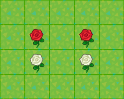 | 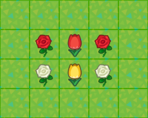 |
|    Diamonds    | 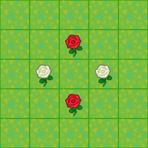 | 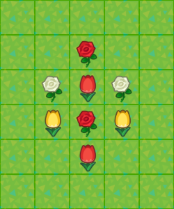 |

## Lilies

Lilies are the easiest flowers to breed.

Pink, orange and black lilies are all first-generation breeds.

* **Combinations**

|       Parent        |       Parent        |                    Child                     |    Chance    |
| :-----------------: | :-----------------: | :------------------------------------------: | :----------: |
| ![][WL]![SW][]`002` | ![][RL]![SR][]`201` |             ![][PL]![BP][]`101`              |     50%      |
| ![][YL]![SY][]`020` | ![][RL]![SR][]`201` |             ![][OL]![BP][]`110`              |     50%      |
| ![][RL]![SR][]`201` | ![][RL]![SR][]`201` | ![][BL]![BP][]`200` ![][PL]![BP][]`202` | 25% 25% |

* **Breeding Example**

| Step |                      Layout                      |                   Parents                    |                           Children                           |
| :--: | :----------------------------------------------: | :------------------------------------------: | :----------------------------------------------------------: |
|  1   |  | ![][YL]![SY][]`020` ![][RL]![SR][]`201` | ![][OL]![BP][]`110` ![][BL]![BP][]`200` ![][PL]![BP][]`202` |

## Cosmos

* **Combinations**

|                    Parent                    |                    Parent                    |                            Child                             |              Chance               |
| :------------------------------------------: | :------------------------------------------: | :----------------------------------------------------------: | :-------------------------------: |
|             ![][WC]![SW][]`001`              |             ![][RC]![SR][]`200`              |         ![][PC]![BP][]`100` ![PC][]![BP][]`101`         |           50% 50%            |
|             ![][YC]![SY][]`021`              |             ![][RC]![SR][]`200`              |         ![][OC]![BP][]`110` ![OC][]![BP][]`111`         |           50% 50%            |
| ![][OC]![BP][]`110` ![OC][]![BP][]`111` | ![][OC]![BP][]`110` ![OC][]![BP][]`111` | ![][PC]![BP][]`100` ![][PC]![BP][]`101` ![][PC]![BP][]`102` ![][PC]![BP][]`112` ![][BC]![BP][]`220` ![BC][]![BP][]`221` | 12.5% ~ 18.75% 4.69% ~ 6.25% |
|             ![][OC]![NM][]`211`              |             ![][OC]![NM][]`211`              |         ![][BC]![BP][]`220` ![BC][]![BP][]`221`         |         6.25% 12.5%          |

* **Breeding Example**

| Step |                      Layout                      |                   Parents                    |                           Children                           |
| :--: | :----------------------------------------------: | :------------------------------------------: | :----------------------------------------------------------: |
|  1   | 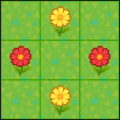 | ![][YC]![SY][]`021` ![][RC]![SR][]`200` |         ![][OC]![BP][]`110` ![OC][]![BP][]`111`         |
|  2   | 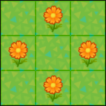 | ![][OC]![BP][]`110` ![OC][]![BP][]`111` | ![][PC]![BP][]`100` ![][PC]![BP][]`101` ![][PC]![BP][]`102` ![][PC]![BP][]`112` ![][BC]![BP][]`220` ![BC][]![BP][]`221` |

## Hyacinths

* **Combinations**

|                    Parent                    |                    Parent                    |                            Child                             |                Chance                |
| :------------------------------------------: | :------------------------------------------: | :----------------------------------------------------------: | :----------------------------------: |
|             ![][WH]![SW][]`001`              |             ![][WH]![SW][]`001`              |                     ![][UH]![BP][]`002`                      |                 25%                  |
|             ![][WH]![SW][]`001`              |             ![][RH]![SR][]`201`              |                     ![][PH]![BP][]`101`                      |                 50%                  |
|             ![][YH]![SY][]`020`              |             ![][RH]![SR][]`201`              |                     ![][OH]![BP][]`110`                      |                 50%                  |
|             ![][OH]![BP][]`110`              |             ![][OH]![BP][]`110`              | ![][OH]![BP][]`110` ![][OH]![NM][]`120` ![][UH]![NM][]`210` ![][LH]![BP][]`220` | 25% 12.5% 12.5% 6.25% |
| ![][OH]![NM][]`120` ![][UH]![NM][]`210` | ![][OH]![NM][]`120` ![][UH]![NM][]`210` |                     ![][LH]![BP][]`220`                      |                 25%                  |

* **Breeding Example**

| Step |                      Layout                      |                           Parents                            |                           Children                           |
| :--: | :----------------------------------------------: | :----------------------------------------------------------: | :----------------------------------------------------------: |
|  1   | 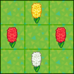 | ![][WH]![SW][]`001` ![][YH]![SY][]`020` ![][RH]![SR][]`201` |         ![][PH]![BP][]`101` ![][OH]![BP][]`110`         |
|  2   |  |                     ![][OH]![BP][]`110`                      | ![][OH]![BP][]`110` ![][OH]![NM][]`120` ![][UH]![NM][]`210` ![][LH]![BP][]`220` |
|  3   | 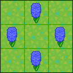 |                     ![][UH]![NM][]`210`                      |         ![][UH]![NM][]`210` ![][LH]![BP][]`220`         |

## Tulips

* **Combinations**

|                    Parent                    |                    Parent                    |                            Child                             |                     Chance                      |
| :------------------------------------------: | :------------------------------------------: | :----------------------------------------------------------: | :---------------------------------------------: |
|             ![][WT]![SW][]`001`              |             ![][RT]![SR][]`201`              |                     ![][PT]![BP][]`101`                      |                       50%                       |
|             ![][YT]![SY][]`020`              |             ![][RT]![SR][]`201`              |                     ![][OT]![BP][]`110`                      |                       50%                       |
|             ![][RT]![SR][]`201`              |             ![][RT]![SR][]`201`              |                     ![][BT]![BP][]`200`                      |                       25%                       |
|             ![][OT]![BP][]`110`              |             ![][OT]![BP][]`110`              | ![][OT]![BP][]`110` ![][OT]![NM][]`120` ![][BT]![BP][]`200` ![][BT]![NM][]`210` ![][LT]![BP][]`220` | 25% 12.5% 6.25% 12.5% 6.25% |
|             ![][OT]![BP][]`110`              |             ![][OT]![NM][]`120`              | ![][OT]![BP][]`110` ![][OT]![NM][]`120` ![][BT]![NM][]`210` ![][LT]![BP][]`220` |       25% 25% 12.5% 12.5%        |
| ![][OT]![NM][]`120` ![BT][]![NM][]`210` | ![][OT]![NM][]`120` ![BT][]![NM][]`210` |                     ![][LT]![BP][]`220`                      |                       25%                       |

* **Breeding Example**

| Step |                      Layout                      |                           Parents                            |                           Children                           |
| :--: | :----------------------------------------------: | :----------------------------------------------------------: | :----------------------------------------------------------: |
|  1   | 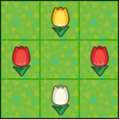 | ![][WT]![SW][]`001` ![][YT]![SY][]`020` ![][RT]![SR][]`201` |         ![][PT]![BP][]`101` ![][OT]![BP][]`110`         |
|  2   | 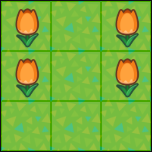 |                     ![][OT]![BP][]`110`                      | ![][OT]![BP][]`110` ![][OT]![NM][]`120` ![][BT]![BP][]`200` ![][BT]![BP][]`210` ![][LT]![BP][]`220` |

Step 2 produces new orange children, from which 2/3 are `110` and 1/3 is `120`. When an orange pair produces a white, yellow or red child, it means both parents are `110`. Thus you can replace them with new orange children, in hope that some of them are `120`, which give better chances of purple, either coupled together or with `110`.

## Pansies

Pansies and windflowers share the same color determination rules, with yellow pansy corresponding to orange windflower, and orange pansy corresponding to pink windflower.

* **Combinations**

|                    Parent                    |                    Parent                    |                            Child                             | Chance |
| :------------------------------------------: | :------------------------------------------: | :----------------------------------------------------------: | :----: |
|             ![][WP]![SW][]`001`              |             ![][WP]![SW][]`001`              |                     ![][UP]![BP][]`002`                      |  25%   |
|             ![][YP]![SY][]`020`              |             ![][RP]![SR][]`200`              |                     ![][OP]![BP][]`110`                      |  100%  |
|             ![][UP]![BP][]`002`              |             ![][RP]![SR][]`200`              |                     ![][RP]![BP][]`101`                      |  100%  |
|             ![][RP]![BP][]`101`              |             ![][RP]![BP][]`101`              |                     ![][LP]![BP][]`202`                      | 6.25%  |
| ![UP][]![NM][]`102` ![][OP]![NM][]`221` | ![NM][]![UP][]`102` ![NM][]![][OP]`221` | ![][LP]![BP][]`202` ![][LP]![BP][]`212` ![][LP]![BP][]`222` |  25%   |

### Windflowers

Pansies and windflowers share the same color determination rules, with yellow pansy corresponding to orange windflower, and orange pansy corresponding to pink windflower.

* **Combinations**

|                    Parent                    |                    Parent                    |                            Child                             | Chance |
| :------------------------------------------: | :------------------------------------------: | :----------------------------------------------------------: | :----: |
|             ![][WW]![SW][]`001`              |             ![][WW]![SW][]`001`              |                     ![][UW]![BP][]`002`                      |  25%   |
|             ![][OW]![SO][]`020`              |             ![RW][]![SR][]`200`              |                     ![][PW]![BP][]`110`                      |  100%  |
|             ![RW][]![SR][]`200`              |             ![][UW]![BP][]`002`              |                     ![RW][]![BP][]`101`                      |  100%  |
|             ![RW][]![BP][]`101`              |             ![RW][]![BP][]`101`              |                     ![][LW]![BP][]`202`                      | 6.25%  |
| ![UW][]![NM][]`102` ![][PW]![NM][]`221` | ![NM][]![UW][]`102` ![NM][]![][PW]`221` | ![][LW]![BP][]`202` ![][LW]![BP][]`212` ![][LW]![BP][]`222` |  25%   |

## Mums

* **Combinations**

|                    Parent                    |                    Parent                    |                            Child                             |           Chance            |
| :------------------------------------------: | :------------------------------------------: | :----------------------------------------------------------: | :-------------------------: |
|             ![][WM]![SW][]`001`              |             ![][WM]![SW][]`001`              |                     ![][LM]![BP][]`002`                      |             25%             |
|             ![][WM]![SW][]`001`              |             ![][RM]![SR][]`200`              |         ![][PM]![BP][]`100` ![PM][]![BP][]`101`         |        50% 50%         |
|             ![][LM]![BP][]`002`              |             ![][RM]![SR][]`200`              |                     ![][PM]![BP][]`101`                      |            100%             |
|             ![][YM]![SY][]`020`              |             ![][RM]![SR][]`200`              |                     ![][YM]![BP][]`110`                      |            100%             |
|             ![][YM]![BP][]`110`              |             ![][YM]![BP][]`110`              | ![][LM]![BP][]`120` ![LM][]![BP][]`210` ![][GM]![BP][]`220` | 12.5% 12.5% 6.25% |
| ![][LM]![BP][]`120` ![LM][]![BP][]`210` | ![][LM]![BP][]`120` ![LM][]![BP][]`210` | ![][LM]![BP][]`120` ![LM][]![BP][]`210` ![][GM]![BP][]`220` |    50% 50% 25%    |
|             ![][LM]![NM][]`211`              |             ![][LM]![NM][]`211`              |         ![][GM]![BP][]`220` ![GM][]![BP][]`221`         |      6.25% 12.5%       |

## Roses

Roses is the only species which has four genes.

* **Combinations**

|        Parent        |        Parent        |                     Child                      |    Chance    |
| :------------------: | :------------------: | :--------------------------------------------: | :----------: |
| ![][WR]![SW][]`0010` | ![][WR]![SW][]`0010` |              ![][LR]![BP][]`0020`              |     25%      |
| ![][WR]![SW][]`0010` | ![][RR]![SR][]`2001` | ![][PR]![BP][]`1001` ![][PR]![BP][]`1011` | 25% 25% |
| ![][YR]![SY][]`0200` | ![][RR]![SR][]`2001` |              ![][OR]![BP][]`1101`              |     50%      |
| ![][RR]![SR][]`2001` | ![][RR]![SR][]`2001` | ![][BR]![BP][]`2000` ![][PR]![BP][]`2002` | 25% 25% |

### Blue Rose

Blue Rose is the hardest flower to breed because of the fourth gene. There are multiple routes to breed them, these two are the simplest ones. If you have access to Mystery Island Orange Roses, use the Mystery Island Orange Route. Otherwise, use the Asteriation Route.

* **Asteriation Route**

|        Parent        |        Parent        |        Child         | Chance |
| :------------------: | :------------------: | :------------------: | :----: |
| ![][WR]![SW][]`0010` | ![][WR]![SW][]`0010` | ![][LR]![BP][]`0020` |  25%   |
| ![][LR]![BP][]`0020` | ![][RR]![SR][]`2001` | ![][PR]![BP][]`1011` |  50%   |
| ![][PR]![BP][]`1011` | ![][YR]![SY][]`0200` | ![][RR]![BP][]`1110` | 12.5%  |
| ![][RR]![BP][]`1110` | ![][RR]![BP][]`1110` | ![][UR]![BP][]`2220` | 1.56%  |

* **Mystery Island Orange Route**

|        Parent        |        Parent        |                     Child                      |      Chance      |
| :------------------: | :------------------: | :--------------------------------------------: | :--------------: |
| ![][OR]![NM][]`2211` | ![][OR]![NM][]`2211` | ![RR][]![BP][]`2221` ![][UR]![BP][]`2220` | 12.5% 6.25% |
| ![][OR]![NM][]`2211` | ![RR][]![BP][]`2221` | ![RR][]![BP][]`2221` ![][UR]![BP][]`2220` | 12.5% 12.5% |
| ![RR][]![BP][]`2221` | ![RR][]![BP][]`2221` | ![RR][]![BP][]`2221` ![][UR]![BP][]`2220` |   50% 25%   |

### Gold Rose

Gold Rose is a special flower which can only be obtained from a Black Rose which has been watered by a Golden Watering Can.

|                       Parent                       |       Parent       |     Child     | Chance |
| :------------------------------------------------: | :----------------: | :-----------: | :----: |
| ![][BR]![GWC][] Any Black Rose with Gold Flag | Nothing / Any Rose | ![RG][]`0000` |  50%   |

* **Secret of the Golden Watering Can**

The golden watering can waters nine tiles at once in a three by three area, but only the black rose placed in the center tile of that area, just in front of the player, will obtain the gold flag. Because of this, you have to water every single black rose you want to give the gold flag to, one by one.

* **Secret of the Black Rose**

A black rose with the gold flag will have 50% chance for its child to be a gold rose, either when breeding or cloning. The gold flag will stay on the black rose until it produces a gold rose.

* **Secret of the Gold Rose**

Gold roses cannot reproduce by themselves by cloning nor breeding, but they can be chosen as a breeding partner by another adjacent rose. Since their genotype is `0000`, this can create seemingly unsuspected offspring.

* **Golden Watering Can Infinite Durability Trick**

Watering cans of any type will not lose their durability when watering only tiles which have already been watered that day. You can exploit this behavior by pre-watering all needed tiles with a regular can first, and then water your desired black roses with the golden watering can for no durability loss. Rain also pre-waters all tiles on your island for the whole day.

# Efficient Flower Cloning

Cloning happens when a flower succeeds in reproducing and has no available partner.

> An available partner is an adjacent flower of the same species which has not already bred during the current daily refresh.

* **Cloning Mechanics**

When a flower clones, a child flower will spawn next to its parent, at buds stage. The child will have the exact same genes as its parent, and thus the same color.

> Cloning is always the best way to get more flowers.
> Once you have a flower of a color you want, the best way to get more of it is always to clone.

* **Cloning Layouts**

The simplest way to clone a flower is to put it on its own, not touching any other flower of its species. You can add more species to make efficient use of the available space.

| Layout  |                  Single Species                  |                 Multiple Species                 |
| :-----: | :----------------------------------------------: | :----------------------------------------------: |
| Cloning | 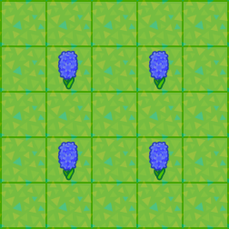 |  |

[News]: img/icon/Post.png "News"
[Coin]: img/icon/Coin.png "Bells"
[IWC]: 	img/icon/WC.png "Iron Watering Can"
[GWC]: 	img/icon/GWC.png "Gold Watering Can"
[LOTV]: img/icon/LOTV.png "Lily of the Valley"

[SW]: 	img/icon/SW.png "White Seed"
[SR]: 	img/icon/SR.png "Red Seed"
[SO]: 	img/icon/SO.png "Orange Seed"
[SY]: 	img/icon/SY.png "Yellow Seed"
[BP]: 	img/icon/WC.png "Breeding"
[NM]: 	img/icon/NMT.png "Nook Miles Island"

[WR]: 	img/icon/RW.png "White Rose"
[RR]: 	img/icon/RR.png "Red Rose"
[YR]: 	img/icon/RY.png "Yellow Rose"
[PR]: 	img/icon/RP.png "Pink Rose"
[OR]: 	img/icon/RO.png "Orange Rose"
[LR]: 	img/icon/RU.png "Purple Rose"
[BR]: 	img/icon/RK.png "Black Rose"
[UR]: 	img/icon/RB.png "Blue Rose"
[RG]: 	img/icon/RG.png "Gold Rose"

[WT]: 	img/icon/TW.png "White Tulip"
[RT]: 	img/icon/TR.png "Red Tulip"
[YT]: 	img/icon/TY.png "Yellow Tulip"
[PT]: 	img/icon/TP.png "Pink Tulip"
[OT]: 	img/icon/TO.png "Orange Tulip"
[LT]: 	img/icon/TU.png "Purple Tulip"
[BT]: 	img/icon/TK.png "Black Tulip"

[WP]: 	img/icon/PW.png "White Pansy"
[RP]: 	img/icon/PR.png "Red Pansy"
[YP]: 	img/icon/PY.png "Yellow Pansy"
[OP]: 	img/icon/PO.png "Orange Pansy"
[LP]: 	img/icon/PU.png "Purple Pansy"
[UP]: 	img/icon/PB.png "Blue Pansy"

[RC]: 	img/icon/CR.png "Red Cosmos"
[WC]: 	img/icon/CW.png "White Cosmos"
[YC]: 	img/icon/CY.png "Yellow Cosmos"
[BC]: 	img/icon/CK.png "Black Cosmos"
[OC]: 	img/icon/CO.png "Orange Cosmos"
[PC]: 	img/icon/CP.png "Pink Cosmos"

[WL]: 	img/icon/LW.png "White Lily"
[RL]: 	img/icon/LR.png "Red Lily"
[YL]: 	img/icon/LY.png "Yellow Lily"
[PL]: 	img/icon/LP.png "Pink Lily"
[OL]: 	img/icon/LO.png "Orange Lily"
[BL]: 	img/icon/LK.png "Black Lily"

[RH]: 	img/icon/HR.png "Red Hyacinth"
[WH]: 	img/icon/HW.png "White Hyacinth"
[YH]: 	img/icon/HY.png "Yellow Hyacinth"
[LH]: 	img/icon/HU.png "Purple Hyacinth"
[OH]: 	img/icon/HO.png "Orange Hyacinth"
[PH]: 	img/icon/HP.png "Pink Hyacinth"
[UH]: 	img/icon/HB.png "Blue Hyacinth"

[RW]: 	img/icon/WR.png "Red Windflower"
[WW]: 	img/icon/WW.png "White Windflower"
[UW]: 	img/icon/WB.png "Blue Windflower"
[LW]: 	img/icon/WU.png "Purple Windflower"
[PW]: 	img/icon/WP.png "Pink Windflower"
[OW]: 	img/icon/WO.png "Orange Windflower"

[RM]: 	img/icon/MR.png "Red Mum"
[WM]: 	img/icon/MW.png "White Mum"
[YM]: 	img/icon/MY.png "Yellow Mum"
[LM]: 	img/icon/MU.png "Purple Mum"
[PM]: 	img/icon/MP.png "Pink Mum"
[GM]: 	img/icon/MG.png "Green Mum"