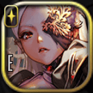

### Re:Birth Labyrinth Level 5

<table class="prop-table">
<tbody>
  <tr>
    <th colspan="3">Damage (1~2)</th>
  </tr>
  <tr>
    <td> Eve</td>
    <td> Deino</td>
    <td> Nicole</td>
  </tr>
  <tr>
    <td> Bathory</td>
    <td> Demeter</td>
    <td> Daphnis</td>
  </tr>
  <tr>
    <th colspan="3">Defense (1~2)</th>
  </tr>
  <tr>
    <td> Dana</td>
    <td> Athena</td>
    <td></td>
  </tr>
  <tr>
    <th colspan="3">Healing (1~2)</th>
  </tr>
  <tr>
    <td> Neptune</td>
    <td> Pomona</td>
    <td> Syrinx</td>
  </tr>
  <tr>
    <td> Pallas</td>
    <td> Maat</td>
    <td> Astraea</td>
  </tr>
  <tr>
    <th colspan="3">Speed (0~2)</th>
  </tr>
  <tr>
    <td> Chang'e</td>
    <td> Mona</td>
    <td></td>
  </tr>
</tbody>
</table>

